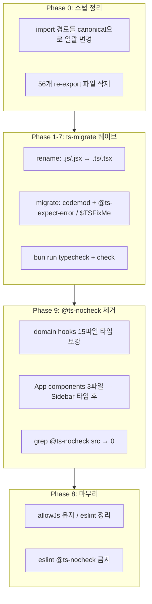

# ts-migrate로 잔존 JS/JSX 전량 TypeScript 전환 계획

## 진행 현황 (2026-08-26)

| 항목 | 상태 |
|------|------|
| `src/` JS/JSX | **0** (610 TS/TSX) |
| `@ts-nocheck` in `src/` | **0** |
| `ts-migrate` + `tsconfig.migrate.json` | 완료 |
| `bun run typecheck` | **87 errors** (33 files) — **차단 요인** |
| `bun run check` | typecheck 실패로 미통과 |

**잔여 87건 오류 패턴 (수동 수정 대상, `ts-migrate reignore` 재실행 금지)**

- `useState([])` / `useState(null)` → `never[]` / `null` (`ChatWithMyselfPane`, `ChatComposer`, `ExportPDFPage` 등)
- `motion` `Transition` + `exactOptionalPropertyTypes` (chat 컴포넌트 다수)
- `forwardRef` props 미타입 (`ChatMessageList`, `ChatComposer`)
- `CoverPlaceMode`, `RebuildCheckpointInfo` state 타입 (`ExportPDFPage`, `SettingsPage`)
- CSS custom properties on `style` (`ExportPDFPage`)

**권장 다음 작업 (Agent 모드)**

1. [`src/utils/chatWithMyself/messageTypes.ts`](src/utils/chatWithMyself/messageTypes.ts) 추가 — `ChatMessage`, `ChatGroup`, `ComposerImageQueueItem`, `ChecklistTask`
2. `OGData`에 `embedHtml?` 추가 ([`og.ts`](src/utils/chatWithMyself/og.ts))
3. 위 33파일 `useState`/`useRef` 제네릭 보강 + motion `as Transition`
4. eslint `@typescript-eslint/ban-ts-comment` (`@ts-nocheck` error)
5. `bun run check` 통과 확인

**주의:** `ts-migrate reignore`를 대량 재실행하면 JSX 내부에 `// @ts-expect-error` 텍스트 노드가 섞이고 unused directive가 폭증함. 오류는 **타입 보강** 또는 **해당 줄만** `@ts-expect-error`로 처리.

---

**도구 확정:** npm에 `@tscity/cli`는 없음 → **Airbnb [`ts-migrate`](https://github.com/airbnb/ts-migrate)** 사용 (사용자 확인).

**현재 상태**

| 항목 | 수치 |
|------|------|
| `src/` JS/JSX | **232** 파일, **~47,786** 줄 |
| `src/` TS/TSX | **508** 파일 (이미 절반 이상 전환) |
| re-export 스텁 (≤2줄) | **56** (컴포넌트 34 + utils 22) |
| 실질 구현 파일 | **~176** |
| `tsconfig` | `strict`, `exactOptionalPropertyTypes`, `noUncheckedIndexedAccess`, `verbatimModuleSyntax` |
| `@ts-nocheck` (현재) | **17** 파일 — `src/App/hooks` 15 + `src/App/components` 3 |

**아키텍처 개요**



---

## 1. 사전 준비

### 1.1 의존성·스크립트

[`package.json`](package.json)에 devDependency 추가:

```bash
bun add -d ts-migrate
```

`package.json` scripts에 헬퍼 추가 (예시):

```json
"migrate:rename": "ts-migrate rename .",
"migrate:codemod": "ts-migrate migrate ."
```

**`ts-migrate-full`은 사용하지 않음** — 내부에서 `git add/commit`을 자동 수행하므로, 개별 `rename` / `migrate`만 사용.

### 1.2 마이그레이션 전용 tsconfig (권장)

[`tsconfig.json`](tsconfig.json)은 프로덕션 strict 설정을 유지. 마이그레이션 동안만 [`tsconfig.migrate.json`](tsconfig.migrate.json)을 추가:

- `extends: "./tsconfig.json"`
- `compilerOptions`: `noImplicitAny: false` (ts-migrate 기본 `$TSFixMe` alias와 호환)
- `include`: 웨이브별로 `--sources`와 동일한 glob

`ts-migrate migrate`는 프로젝트 `tsconfig.json`을 읽으므로, 웨이브 시작 전 `tsconfig.json`을 일시적으로 완화하거나, 마이그레이션용 설정을 문서화해 수동 전환하는 방식을 택해야 함. **1차 목표는 “컴파일 통과”**이며, strict 복원은 후속 PR에서 진행.

### 1.3 워크스페이스 규칙 정합

[`.cursor/rules/typescript-migration.mdc`](.cursor/rules/typescript-migration.mdc)는 현재 “대량 일괄 변환 금지”를 명시. 전량 전환 완료 후 규칙을 **“JS 금지, allowJs 유지”**로 업데이트하는 follow-up을 계획에 포함.

---

## 2. Phase 0 — re-export 스텁 제거 (ts-migrate 전 필수)

56개 스텁은 rename만 하면 `.tsx` re-export가 남아 구조가 악화됨. **canonical 파일만 변환**하기 위해 먼저 정리.

### 스텁 패턴 (예시)

```1:1:src/components/Sidebar.jsx
export { default } from '@/components/shell/Sidebar.jsx';
```

```1:1:src/utils/crypto.js
export * from '@/utils/shared/crypto.js';
```

### 작업

1. **import 경로 일괄 치환** (codemod 또는 스크립트)
   - `@/components/Sidebar.jsx` → `@/components/shell/Sidebar`
   - `@/utils/crypto.js` → `@/utils/shared/crypto`
   - `.js` / `.jsx` 확장자 제거 (`@/` alias + Vite resolver에 의존)
2. **56개 스텁 파일 삭제**
3. `bun run check`로 회귀 없음 확인

**스텁 목록 (대표)**

- 컴포넌트: [`src/components/Sidebar.jsx`](src/components/Sidebar.jsx), [`src/components/MarkdownEditor.jsx`](src/components/MarkdownEditor.jsx), [`src/components/modals/*.jsx`](src/components/modals/) 등 → 각각 `shell/`, `editor/`, `shared/modals/` canonical 경로
- utils: [`src/utils/crypto.js`](src/utils/crypto.js), [`src/utils/webdavClient.js`](src/utils/webdavClient.js) 등 → `shared/`, `vault/`, `llm/`, `print/` canonical 경로

---

## 3. Phase 1–7 — ts-migrate 웨이브 (의존성 순)

각 웨이브 공통 절차:

```bash
# 1) rename
bunx ts-migrate rename . \
  -s "src/<wave-glob>" \
  -s "node_modules/**/*.d.ts"

# 2) migrate (codemod)
bunx ts-migrate migrate . \
  -s "src/<wave-glob>" \
  -s "node_modules/**/*.d.ts"

# 3) 검증
bun run typecheck
bun run check
```

| 웨이브 | `--sources` glob | 파일 수(대략) | 비고 |
|--------|------------------|---------------|------|
| **1** | `src/utils/**/*.js` | ~78 | 경계 레이어 우선; chat/storage/S3/WebDAV |
| **2** | `src/hooks/**/*.js`, `src/extensions/**/*.js`, `src/config/**/*.js` | ~12 | 훅·markdown-it·novel 확장 |
| **3** | `src/components/shared/**/*.jsx`, `src/components/modals/**/*.jsx` | ~26 | 모달·공유 UI (canonical) |
| **4** | `src/components/shell/**/*.jsx`, `src/components/workspace/**/*.jsx` | ~10 | Sidebar(1898줄), EditorPane, TreeNode |
| **5** | `src/components/editor/**/*.jsx`, `src/components/print/**/*.jsx`, `src/components/recording/**/*.jsx`, `src/components/llm/**/*.jsx` | ~18 | MarkdownEditor(2691줄), Novel, ExportPDF |
| **6** | `src/components/chatWithMyself/**/*.jsx`, `src/components/chatWithMyself/**/*.js` | ~35 | ChatWithMyselfPane(2964줄) — **가장 큰 웨이브** |
| **7** | `src/pages/**/*.jsx`, `src/components/**/*.jsx` (잔여) | ~15 | ExportPDFPage(2295줄), SettingsPage(1717줄) |

**대형 파일 우선순위 (리스크)**

| 파일 | 줄 수 | 전략 |
|------|-------|------|
| [`ChatWithMyselfPane.jsx`](src/components/chatWithMyself/ChatWithMyselfPane.jsx) | 2964 | 웨이브 6 단독 PR; migrate 후 수동 타입 보강 분리 |
| [`MarkdownEditor.jsx`](src/components/editor/MarkdownEditor.jsx) | 2691 | 웨이브 5; md-editor-rt 타입은 `@ts-expect-error` 다수 예상 |
| [`ExportPDFPage.jsx`](src/pages/ExportPDFPage.jsx) | 2295 | 웨이브 7 |
| [`Sidebar.jsx`](src/components/shell/Sidebar.jsx) | 1898 | 웨이브 4 |
| [`chatWithMyself/storage.js`](src/utils/chatWithMyself/storage.js) | 1232 | 웨이브 1 |

---

## 4. ts-migrate 동작 기대치·수동 후처리

ts-migrate는 **타입을 “완성”하지 않음**. FAQ에 따라:

- `@ts-expect-error` / `@ts-ignore` 대량 삽입
- `$TSFixMe` (= `any`) alias 사용
- PropTypes → interface (해당 시)
- JSDoc `@param` → 타입 (utils에 JSDoc 다수 존재)

### 프로젝트별 추가 수동 작업

1. **import 확장자** — 현재 다수 `from '@/utils/.../paths.js'`. `verbatimModuleSyntax` + `allowImportingTsExtensions` 환경에서 rename 후 `.ts`로 갱신 필요 ([`src/utils/chatWithMyself/index.js`](src/utils/chatWithMyself/index.js) 등 27개 import).
2. **React 19 컴포넌트** — `ref`/`children` 타입; ts-migrate React 플러그인은 React 19 미검증.
3. **Dexie / WebDAV / File System Access** — DOM/브라우저 API 타입 보강.
4. **ESLint** — [`eslint.config.js`](eslint.config.js)의 `**/*.{js,jsx}` 블록은 전환 완료 후 제거 또는 축소.

### 품질 게이트 (웨이브마다)

- `bun run typecheck` — 4개 tsconfig 모두 통과
- `bun run check` — eslint + typecheck + vitest
- `bun run build` — 웨이브 4 이후(셸) / 웨이브 7 이후(페이지) 최소 1회

---

## 5. Phase 9 — `@ts-nocheck` 전량 제거 (17파일)

현재 `@ts-nocheck`는 **파일 단위로 tsc를 끄는 임시 우회**이며, 단순 삭제만으로는 `bun run typecheck`가 실패한다. 각 파일에서 nocheck를 **제거한 뒤** 타입 오류를 실제로 해결해야 한다.

### 5.1 대상 파일

**Domain hooks (15)** — [`src/App/hooks/`](src/App/hooks/)

| 파일 | nocheck 주석에 적힌 의도 |
|------|-------------------------|
| `useBootstrapDomain.ts` | context-owned, no bag/glueRef |
| `useSessionWorkspaceDomain.ts` | 동일 |
| `useFileOpenRoutingDomain.ts` | 동일 |
| `useDownloadSessionDomain.ts` | 동일 |
| `useChatIntegrationDomain.ts` | 동일 |
| `useAdvancedSearchTabsDomain.ts` | 동일 |
| `useAppChromeDomain.ts` | 동일 |
| `useEditorImageDownloadDomain.ts` | 동일 |
| `useTempChatRecordingDomain.ts` | 동일 |
| `useRecordingVaultEffectsDomain.ts` | 동일 |
| `usePwaSnippetsDomain.ts` | PWA + snippet sync |
| `useWorkspaceTabsDomain.ts` | tighten with `WorkspaceTabsCtxValue` |
| `useFileSessionDomain.ts` | tighten with `FileSessionValue` |
| `useTreeOpsDomain.ts` | tighten with `TreeOpsValue` |
| `useVaultDomain.ts` | tighten with `VaultValue` |

**Compose / shared (1)**

| 파일 | 의도 |
|------|------|
| `useAppLogicSharedState.ts` | providers + setup + domain compose |

**App components (3)** — [`src/App/components/`](src/App/components/)

| 파일 | 선행 조건 |
|------|-----------|
| `SidebarConnected.tsx` | [`Sidebar.jsx`](src/components/shell/Sidebar.jsx) → `.tsx` + props interface (웨이브 4) |
| `AppLayout.tsx` | domain context value 타입 정리 (Phase 9a와 병행) |
| `AppModals.tsx` | modal-lib props 타입; `AppModalsContext` slice 활용 |

[`eslint.config.js`](eslint.config.js) 8행 주석은 `@ts-nocheck`를 “bag wiring 버그 탐지용”으로 설명 — Phase 9 완료 후 주석을 갱신하거나 `lint:app-logic` 범위를 조정.

### 5.2 작업 절차 (파일 단위)

1. `@ts-nocheck` 줄 **삭제**
2. `bun run typecheck`로 해당 파일 관련 오류 목록 확보
3. 오류 종류별 처리 (우선순위):
   - **context/provider value** — 기존 `*CtxValue` / `*Value` 타입 export·적용 (`WorkspaceTabsCtxValue`, `FileSessionValue`, `TreeOpsValue`, `VaultValue` 등 주석에 이미 명시)
   - **glueRef / bag 잔존** — D2 리팩터 완료분은 ref 타입 명시; 미완 파일은 compose 타입부터 정리
   - **implicit any / unknown callback** — 파라미터·반환 타입 추가 (`any` 남발은 `@ts-expect-error`보다 구체 타입 우선)
   - **`exactOptionalPropertyTypes`** — `undefined` 명시 vs optional property 분리
4. `bun run check` 통과 후 커밋

**금지:** nocheck 제거와 동시에 새 `@ts-nocheck` 추가. 일시적 우회가 필요하면 **해당 줄** `@ts-expect-error` + 한 줄 설명 (ts-migrate가 넣은 것과 동일 규칙).

### 5.3 Phase 9 웨이브 (PR 권장)

| 단계 | 범위 | PR 의존성 |
|------|------|-----------|
| **9a** | `useAppLogicSharedState` + domain hooks 15개 | 웨이브 1(utils) 이후 권장 — storage/chat 타입 가용 |
| **9b** | `SidebarConnected`, `AppLayout`, `AppModals` | 웨이브 4(Sidebar `.tsx`) **완료 후** |

### 5.4 완료 게이트

```bash
# src 전체 0건
rg '@ts-nocheck' src/
```

추가: [`eslint.config.js`](eslint.config.js)에 `@typescript-eslint/ban-ts-comment` 규칙으로 `@ts-nocheck` **error** ( `@ts-expect-error`는 허용 — ts-migrate 잔존·점진 정리용).

---

## 6. Phase 8 — 전환 완료 후 정리

1. **`src/`에 `.js` / `.jsx` 0개** 확인
2. **`@ts-nocheck` 0건** 확인 (Phase 9 게이트)
3. **`allowJs: true` 유지** — `checkJs`는 계속 off
4. **`.cursor/rules/typescript-migration.mdc` 업데이트** — “JS 금지, `@ts-nocheck` 금지”
5. **ESLint** — `**/*.{js,jsx}` 블록 축소/제거, `@ts-nocheck` ban
6. **점진적 타입 품질** (별도 트랙, 완료 정의 밖)
   - `@ts-expect-error` / `$TSFixMe` 제거
   - chat/storage 도메인 interface 정밀화

---

## 7. PR·브랜치 전략

- **베이스 브랜치:** App hooks D2 리팩터와 JS 전환 **병렬 충돌** 가능. 웨이브 1(utils)부터; Phase 9a는 D2 안정화 후 착수 권장.
- **PR 단위:** Phase 0 1 PR + 웨이브 1–7 각 1 PR + Phase 9a 1 PR + Phase 9b 1 PR + Phase 8 1 PR (총 **~11 PR**). 웨이브 6·7·9a 분할 가능.
- **커밋 메시지 예:**
  - `refactor: migrate utils to TypeScript via ts-migrate`
  - `refactor: remove @ts-nocheck from App domain hooks`

---

## 8. 리스크·완화

| 리스크 | 완화 |
|--------|------|
| ts-migrate가 코드 손상 | 웨이브 단위 + `bun run check`; 문제 시 해당 웨이브만 revert |
| strict tsconfig로 migrate 실패 | 마이그레이션 중 `noImplicitAny: false`; strict는 후속 |
| 2964줄 ChatWithMyselfPane | 단독 웨이브; 필요 시 파일 분할은 **전환 후** 별도 리팩터 |
| import 경로 `.js` 잔존 | Phase 0 + rename 후 일괄 codemod |
| ts-migrate 유지보수 | Airbnb 전용, React 19 미보장 — 대안 `jsts-convert`는 웨이브 실패 시 폴백 |
| nocheck 제거 시 오류 폭증 | 파일 단위 PR; context `*Value` 타입부터; 9b는 Sidebar `.tsx` 후 |
| D2 리팩터와 Phase 9a 충돌 | 9a는 utils 웨이브 + D2 merge 지점 이후 착수 |

---

## 9. 예상 일정 (참고)

| 단계 | 예상 |
|------|------|
| Phase 0 스텁 정리 | 0.5–1일 |
| 웨이브 1–3 (utils·훅·모달) | 2–3일 |
| 웨이브 4–5 (셸·에디터) | 2–3일 |
| 웨이브 6–7 (채팅·페이지) | 3–5일 |
| Phase 9a (hooks nocheck) | 2–4일 |
| Phase 9b (components nocheck) | 1–2일 |
| `@ts-expect-error` 점진 정리 | 수주 (별도 트랙) |

**완료 정의 (이 계획의 Done):**

1. `src/` **JS/JSX 0개**
2. `src/` **`@ts-nocheck` 0건**
3. `bun run check` 통과 + **빌드 성공**
4. eslint **`@ts-nocheck` 금지** 규칙 적용

`@ts-expect-error` / `$TSFixMe` 전량 제거는 완료 정의에 **포함하지 않음** (ts-migrate 후속 트랙).
