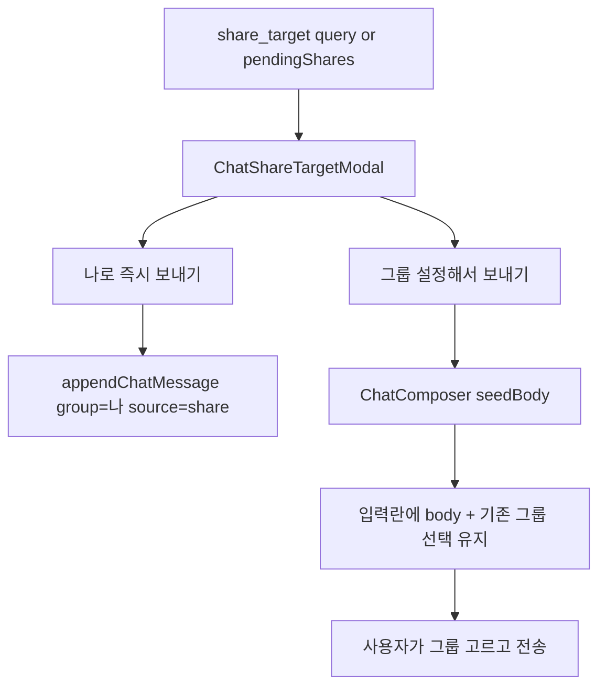

# Share target 전송 옵션 선택

## 현재 동작

[`ChatWithMyselfPane.jsx`](src/components/chatWithMyself/ChatWithMyselfPane.jsx)가 `title`/`text`/`url` 쿼리를 받으면 `appendShareBody`로 그룹 `"나"`에 즉시 저장합니다. `pendingShares` flush도 동일하게 자동 전송합니다.

## 목표 흐름

## 구현

### 1. 선택 모달 추가

새 파일 [`src/components/chatWithMyself/ChatShareTargetModal.jsx`](src/components/chatWithMyself/ChatShareTargetModal.jsx)

- 기존 [`Modal`](src/components/modals/Modal.jsx) 셸 재사용
- share body 미리보기(짧으면 전체, 길면 truncate)
- 버튼 2개:
  - **나로 즉시 보내기** → `onSendAsSelf`
  - **그룹 설정해서 보내기** → `onComposeWithGroup`
- **취소**(Esc/`onClose`) → 해당 share 폐기(pending 삭제, 프롬프트 닫기)

### 2. Pane: 자동 전송 → 프롬프트 큐

[`ChatWithMyselfPane.jsx`](src/components/chatWithMyself/ChatWithMyselfPane.jsx)

- state: `sharePrompt` (`{ id?, body }` | null), `composerSeed` (`{ id, body }` | null)
- share ingest effect: `appendShareBody` 호출 제거 → body만 파싱 후 쿼리 clear → `storageReady`면 `sharePrompt` 설정, 아니면 기존처럼 `savePendingShare`
- pending flush: `appendShareBody` 대신 첫 항목을 `sharePrompt`로 올리고, 선택 완료 후 `deletePendingShare` + 다음 pending 있으면 이어서 표시
- **나로 즉시 보내기**: 기존 `appendShareBody(body)` 유지(`group: SELF_GROUP`, `source: 'share'`)
- **그룹 설정해서 보내기**: `composerSeed` 설정 후 프롬프트 닫기(그룹은 현재 `selectedGroup` 유지)

### 3. Composer: seed로 입력란 채우기

[`ChatComposer.jsx`](src/components/chatWithMyself/ChatComposer.jsx)

- props: `seedBody` (`{ id, body } | null`), `onSeedConsumed`
- `draftReady` 이후 `seedBody.id` 변경 시:
  - `setValue(seedBody.body)`
  - `writeComposerDraftMeta`로 body 반영(기존 draft images/reply는 유지, body만 교체)
  - `onSeedConsumed()` 호출
- 사용자가 그룹 select로 고른 뒤 평소처럼 `onSend` 전송

## 기본값 (명시)

- 컴포저에 이미 draft가 있어도 **body는 share 내용으로 교체**(이미지는 유지)
- 취소는 share **폐기**(다시 물어보지 않음)
- 여러 pending share는 **한 건씩** 모달

## 테스트

- `/chat?url=https://example.com` → 모달 → 나로 즉시 → 메시지 추가
- 같은 URL → 그룹 설정해서 보내기 → 입력란에 URL → 다른 그룹 선택 후 전송
- 잠금 상태에서 share → unlock 후 모달 표시
