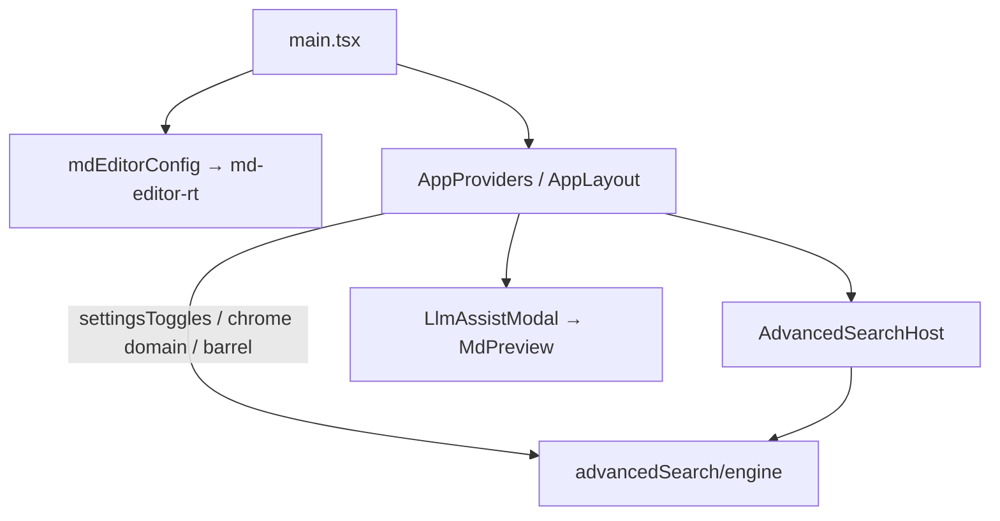

# Dev cold path: shell B 최적화

## 문제

측정된 critical path (`main` → shell → `AdvancedSearchHost` / Settings)가 ~14초. 원인은 Vite deps 파편화뿐 아니라 **셸이 AS Host·engine·md-editor를 정적 import**하기 때문.

## 접근 (확정)

1. **AS Host lazy** + open 요청 큐 + 셸 Cmd+K 브리지  
2. **셸에서 engine/배럴 정적 의존 제거** (deep import / dynamic import)  
3. **mdEditorConfig 지연** + **LlmAssistModal lazy**

---

## 1. AdvancedSearchHost lazy + open 브리지

**변경**

- [`src/App/components/AppLayout.tsx`](src/App/components/AppLayout.tsx): `AdvancedSearchHost`를 `React.lazy` + `<Suspense fallback={null}>` (unlock 시 기존과 같이 마운트).
- [`src/App/components/ExportPdfGate.tsx`](src/App/components/ExportPdfGate.tsx): 동일.
- [`src/utils/advancedSearch/openRequest.ts`](src/utils/advancedSearch/openRequest.ts):
  - listener 없을 때 `pendingDetail` 보관
  - `subscribe` 시 pending flush
  - `preloadAdvancedSearchHost()` = memoized `import('@/components/advancedSearch/AdvancedSearchHost')`
- 새 모듈 [`src/components/advancedSearch/AdvancedSearchHotkeyBridge.tsx`](src/components/advancedSearch/AdvancedSearchHotkeyBridge.tsx) (경량):
  - capture-phase `Mod+K` → `preload` + `requestOpenAdvancedSearch`
  - AppLayout(unlock 시) / ExportPdfGate에 **eager** 마운트 (Host보다 먼저)
- [`AdvancedSearchSidebarTrigger.tsx`](src/components/advancedSearch/AdvancedSearchSidebarTrigger.tsx): `@/utils/advancedSearch` 배럴 대신 `@/utils/advancedSearch/openRequest`만 import; 클릭/호버 시 `preloadAdvancedSearchHost()`.

첫 Cmd+K는 Host chunk 로드 1회 대기 가능 — pending flush로 열림 보장.

---

## 2. 셸에서 AS engine 정적 그래프 끊기

lazy Host만으로는 부족: 아래가 여전히 engine/배럴을 끌어옴.

| 위치 | 조치 |
|------|------|
| [`useFileSessionDomain.ts`](src/App/hooks/useFileSessionDomain.ts), [`useTreeOpsDomain.ts`](src/App/hooks/useTreeOpsDomain.ts), [`useDownloadSessionDomain.ts`](src/App/hooks/useDownloadSessionDomain.ts) | `notifyAdvancedSearchChange` → `@/utils/advancedSearch/notify` |
| [`useAppChromeDomain.ts`](src/App/hooks/useAppChromeDomain.ts) | `advancedSearchEngine` 정적 import 제거; `configure` / Android disable / `warmIndexAfterUnlock` 안에서 `import('@/utils/advancedSearch/engine')` |
| [`settingsToggles.ts`](src/utils/advancedSearch/settingsToggles.ts) | top-level `engine` import 제거; `settings-as-index` / `settings-as-include-other`의 `load`/`save`만 dynamic import (AppLayout의 `setSettingsToggle`이 engine을 끌어오지 않게) |
| [`yieldToMain`](src/utils/advancedSearch/yieldToMain.ts) | chrome domain은 이미 deep import — 유지 |

Host 내부는 이후 단계로 배럴→deep import 정리 가능하나, **이번 PR은 셸 cold path 차단이 목표**.

---

## 3. md-editor-rt cold path 제거

**변경**

- [`src/main.tsx`](src/main.tsx): `import '@/config/mdEditorConfig'` 삭제.
- 새 [`src/config/ensureMdEditorConfig.ts`](src/config/ensureMdEditorConfig.ts): memoized `import('@/config/mdEditorConfig')`.
- 첫 `MdEditor`/`MdPreview` 전에 `await ensureMdEditorConfig()`:
  - MarkdownEditor, ChatComposerMdEditor, ChatMessageMarkdown, QuizMdPreview, ExportPdfBodyPreview, LlmAssistPanel (마운트 effect 또는 부모 lazy 경계).
- [`AppLayout.tsx`](src/App/components/AppLayout.tsx): `LlmAssistModal`을 `lazy()` + Suspense (셸이 `MdPreview`를 정적 pull하지 않게).
- [`.cursor/rules/vite-chunk-splitting.mdc`](.cursor/rules/vite-chunk-splitting.mdc): “global mdEditorConfig eager” 문구를 **ensureMdEditorConfig / first editor surface**로 갱신.

`initMdEditorCodeCopy` / `initMdEditorToolbarScroll`는 main에 유지 (md-editor-rt 비의존).

---

## 검증

- 서버 재시작 없이(또는 config 미변경 상태) `/` cold reload: Network에서 `AdvancedSearchHost` / `md-editor-rt` / `engine`이 **초기 연쇄에 없음** (Cmd+K 또는 에디터 오픈 후에만).
- unlock 전후 Cmd+K, 사이드바 검색 아이콘, Export PDF 게이트 AS 동작.
- 노트 에디터 / 채팅 미리보기 / LLM 모달: 플러그인·하이라이트 정상 (config 지연 후에도).
- Android Tauri: index disable + warmIndex idle 경로 유지.

## 범위 밖

- Vite deps 청크 3700개 파편화 / `optimizeDeps` 튜닝  
- Settings 페이지 섹션별 code-split (별도)
