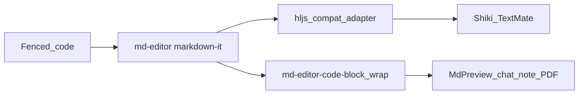

# Shiki로 미리보기 코드 강조 강화

## 기대치 (중요)

현재는 **highlight.js**라 키워드/문자열/주석 위주의 거친 토큰만 보입니다. VS Code에서 라이브러리 함수명이 더 잘 보이는 이유는 대개 **TextMate 문법 + (편집기에서는) LSP 시맨틱 토큰** 때문입니다.

이번 작업으로 얻는 것:

- Shiki(= VS Code와 같은 TextMate 문법)로 **함수/타입/프로퍼티/내장 지원 스코프** 등 문법 색이 훨씬 촘촘해짐
- CDN/`unpkg` 의존 제거 → Tauri·오프라인에서도 동일하게 동작

이번 작업으로 **못** 하는 것:

- 노트 미리보기에서 `useState` 등을 “React API”로 아는 **LSP 시맨틱 하이라이트** (언어 서버 없이는 불가)

## 접근 (고정)

md-editor-rt가 기대하는 **sync highlight.js 모양 API**로 Shiki를 감싸 `editorExtensions.highlight.instance`에 주입합니다. `markdownItConfig`에서 HTML을 직접 반환하면 `showCodeRowNumber` / `.md-editor-code-block` 래핑이 빠져 **Export PDF 줄 분할**이 깨지므로 쓰지 않습니다.



## 구현 요지

### 1. Shiki 하이라이터 + 어댑터

새 모듈 [`src/utils/mdEditorShikiHighlight.ts`](src/utils/mdEditorShikiHighlight.ts):

- `createHighlighter`로 `one-dark-pro` / `one-light` + 자주 쓰는 언어 프리로드  
  (`javascript`, `typescript`, `tsx`, `jsx`, `json`, `css`, `html`, `python`, `bash`, `shell`, `markdown`, `yaml`, `sql`, `rust`, `go`, `java`, `c`, `cpp`, `xml`, `toml`, `dockerfile`, …)
- `langAlias`: `js`→`javascript`, `ts`→`typescript`, `py`→`python`, `sh`→`bash` 등
- 어댑터:
  - `getLanguage(lang)` → 로드·alias 여부
  - `highlight(code, { language })` → `codeToHtml` / `structure: 'inline'` 후 **내부 토큰 HTML만** 반환 (hljs `.value`와 동일)
  - `highlightAuto` → plaintext 또는 `javascript` 폴백
- 테마: dual themes (`light: one-light`, `dark: one-dark-pro`) + `defaultColor: false` → span에 `--shiki-light` / `--shiki-dark`
- 미지원 언어·하이라이터 미준비: escape만 (기존 noHighlight와 유사)

### 2. 부트 순서

[`src/main.tsx`](src/main.tsx)는 지금 `import '@/config/mdEditorConfig'`가 sync입니다.

- `await ensureMdEditorShikiHighlight()` 후 dynamic `import('@/config/mdEditorConfig')` (또는 config 쪽에서 instance를 set)
- 첫 페인트 전에 instance가 있어야 CDN script를 안 탑니다

[`src/config/mdEditorConfig.js`](src/config/mdEditorConfig.js):

```js
editorExtensions: {
  highlight: {
    instance: getMdEditorShikiHljsCompat(),
    css: { /* local or minimal; drop unpkg atom-one URLs */ },
  },
}
```

[`src/utils/mdEditorCodeTheme.ts`](src/utils/mdEditorCodeTheme.ts): CDN URL 제거·주석을 Shiki 기준으로 갱신. `codeTheme` prop 값(`one-dark` / `one-light`)은 유지해 호출부 변경을 최소화.

### 3. CSS

[`src/styles/md-editor-rt/code-one-dark.css`](src/styles/md-editor-rt/code-one-dark.css):

- 블록 크롬(배경/테두리)은 유지
- `.hljs-*` 보정 제거
- 토큰 색 규칙 추가:
  - 일반 미리보기: `color: var(--shiki-dark)` (현행처럼 화면은 다크 코드 블록)
  - `#export-pdf-preview` / export 컨테이너: `color: var(--shiki-light)`

### 4. 번들

- `bun add shiki`
- [`vite.config.ts`](vite.config.ts) `manualChunks`에 `vendor-shiki` (`/node_modules/shiki/`, `/node_modules/@shikijs/`)
- 하이라이터 초기화는 dynamic `import('shiki')`로 main 초기 그래프에서 분리 (규칙: 무거운 의존 lazy)

### 5. 회귀 포인트 (구현 시 확인)

- 노트 `MarkdownEditor` 미리보기, 채팅 `ChatMessageMarkdown`, Quiz/LLM `MdPreview`
- Export PDF: `showCodeRowNumber` + [`prepareExportPdfCodeBlocksForPaging.ts`](src/utils/exportPdf/prepareExportPdfCodeBlocksForPaging.ts)가 `.md-editor-code-block` 줄 분할 유지
- 코드 복사 (`initMdEditorCodeCopy` / `textContent`) 정상
- 펜스 언어 태그 있는 TS/JS 샘플에서 함수·타입·문자열 스코프가 hljs보다 세분되는지 육안 확인

## 의도적으로 하지 않음

- Prism 도입, Novel/TipTap 경로 하이라이트
- LSP/시맨틱 토큰, Twoslash
- `markdownItConfig`에서 full HTML highlight 반환 (PDF 래핑 우회)
