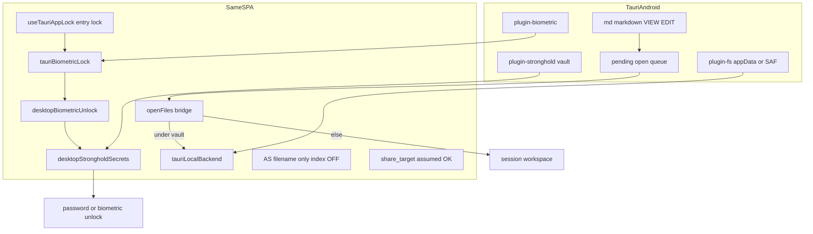

# Android Tauri (사이드로드) 플랜

## 범위 (확정)

| 포함 | 제외 |
|------|------|
| S3 + WebDAV | Google Play / AAB |
| Local Vault | WebAuthn PRF / 브라우저 패스키 |
| Advanced Search lucivy 역색인 (Tauri native lucivy-core) | iOS |
| `.md` / `.markdown` 앱 연결 (기본 오프너로 DocuHaim 사용) | `EncryptedSharedPreferences` 별도 Rust 저장소 |
| 마스터 비밀번호 언락 + **생체인증** (지문·얼굴) | |
| Stronghold 암호화 저장소 + `@tauri-apps/plugin-biometric` 게이트 | |
| 별도 Android workflow + 별도 GitHub Release | |

**전제:** 기존 PWA [`share_target`](vite.config.ts) / [`ShareTargetGate`](src/components/chatWithMyself/ShareTargetGate.jsx) / chat share intake는 **정상 작동함을 전제**한다. 이 플랜에서 share_target을 재구현·수정하지 않는다. Android 셸은 파일 연결(VIEW/EDIT)과 Local/원격 저장소에 집중한다.

**생체인증 전제:** Tauri 모바일용 생체·Stronghold 스택이 이미 준비되어 있다. Android 플랜은 **새 저장소를 만들지 않고** 기존 모듈을 Android 셸에 연결·검증하는 데 집중한다.

## 아키텍처

## 생체인증 (이미 준비됨 — Android에서 연결·검증)

### 구현 현황

| 레이어 | 모듈 | 역할 |
|--------|------|------|
| Rust | [`src-tauri/src/lib.rs`](src-tauri/src/lib.rs) | `#[cfg(mobile)]` → `tauri_plugin_biometric`; Stronghold KDF + `docuhaim-vault.hold` |
| Capability | [`src-tauri/capabilities/mobile.json`](src-tauri/capabilities/mobile.json) | `biometric:default` (Android) |
| 생체 게이트 | [`src/utils/tauriBiometricLock.ts`](src/utils/tauriBiometricLock.ts) | `@tauri-apps/plugin-biometric` → `checkStatus` / `authenticate` |
| 언락·등록 | [`src/utils/desktopBiometricUnlock.ts`](src/utils/desktopBiometricUnlock.ts) | Stronghold에 래핑된 마스터 비밀번호·S3/WebDAV creds; 생체 프롬프트 후 복호화 |
| 비밀 저장 | [`src/utils/desktopStrongholdSecrets.ts`](src/utils/desktopStrongholdSecrets.ts) | 앱 data dir 암호화 스냅샷; biometric app lock / entry lock 마커 |
| 앱 잠금 | [`src/hooks/useTauriAppLock.ts`](src/hooks/useTauriAppLock.ts) + [`desktopAppEntryLock.ts`](src/utils/desktopAppEntryLock.ts) | 백그라운드·포커스 이탈 시 재잠금 |
| 설정 UI | [`DesktopAppEntryLockSettings.tsx`](src/components/settings/DesktopAppEntryLockSettings.tsx) | 비밀번호 / 생체 인증 모드 |
| WebAuthn 어댑터 | [`src/utils/webauthn.js`](src/utils/webauthn.js) | Tauri Android에서는 PRF 대신 `isDesktopBiometricAvailable()` 사용 |
| 라벨 | [`src/utils/webauthnLabel.js`](src/utils/webauthnLabel.js) | Android UA → 「생체 인식」 |

### Android에서 할 일 (신규 구현 아님)

1. **mobile capability 보강** — [`mobile.json`](src-tauri/capabilities/mobile.json)에 `stronghold:default`, `fs:*` (app data / LocalHaim) 추가.
2. **플랫폼 헬퍼** — `isTauriAndroid()` 도입 후 생체·Stronghold·앱 잠금·저장소·openFiles·AS 분기가 Android에서 동작하는지 확인 ([`tauriPlatform.ts`](src/utils/tauriPlatform.ts)의 `isTauriMobilePlatform()` 활용).
3. **WebAuthn PRF 비활성** — Android WebView에서 브라우저 패스키·PRF는 쓰지 않음. 연결 저장·언락 UI는 `webauthn.js` → `desktopBiometricUnlock` 경로(플랫폼 생체)만 노출.
4. **설정 카피** — `DesktopAppEntryLockSettings`에서 `getWebAuthnEncryptLabel()`이 Android에 「생체 인식」을 표시하는지 확인.
5. **검증** — 등록(생체 프롬프트) → Stronghold 저장 → 앱 재시작 → 생체 언락 → S3/WebDAV/Local 연결 복원; 백그라운드 복귀 시 `useTauriAppLock` 재잠금.

### 위협 모델 (요약)

- **생체 게이트**: OS 생체 API(`plugin-biometric`)로 사용자 확인만 수행. 비밀번호·AWS 키·WebDAV 비밀번호 **평문은 Stronghold 암호화 스냅샷**에만 존재.
- **WebAuthn PRF와 구분**: 브라우저 패스키·PRF 확장은 Android Tauri에서 **범위 밖**. 플랫폼 생체(지문·얼굴)만 사용.
- Android는 Stronghold 단일 저장 경로.

## 1. 플랫폼 헬퍼 (Android)

- `isTauriAndroid()` — `@tauri-apps/plugin-os` `platform()` 또는 `navigator.userAgent` + Tauri
- Android 전용 분기: 저장소 백엔드, openFiles, AS 색인 OFF, 설정 노출, 언락·앱 잠금

리팩터 시 `App.jsx` 부트·언락·[`useTauriAppLock`](src/hooks/useTauriAppLock.ts) 경로가 끊기지 않게 한다.

Android 빌드: HashRouter · PWA 비활성 · `VITE_ELECTRON=true` ([`vite.config.ts`](vite.config.ts), [`package.json`](package.json) `build:tauri` / `tauri:vite`).

## 2. Android 셸 스캐폴드

- `bunx tauri android init` → [`src-tauri/gen/android/`](src-tauri/gen/android/) (**생성물 커밋**으로 재현성 우선)
- [`tauri.conf.json`](src-tauri/tauri.conf.json): Android용 `apk` 번들 설정 (AAB/Play 없음)
- [`capabilities/mobile.json`](src-tauri/capabilities/mobile.json): `biometric:default` + **stronghold + fs** (생체인증·LocalHaim)
- 문서: [`docs/desktop/android-sideload.md`](docs/desktop/android-sideload.md) + VitePress sidebar (설치·권한·생체 등록·Release 태그 안내)

## 3. Android workflow + Release

신규 [`.github/workflows/release-tauri-android.yml`](.github/workflows/release-tauri-android.yml):

- `workflow_dispatch` + semver 입력 (기본은 root `package.json` sync와 동일 규칙)
- `ubuntu-latest`: JDK, Android SDK/NDK, Rust Android targets, `bun install`, `tauri android build --apk`
- **별도 GitHub Release** (예: tag `android-vX.Y.Z` 또는 `vX.Y.Z-android`)
- APK만 업로드. 서명 secrets 없으면 unsigned/debug-signed sideload. Play 업로드 없음

## 4. `.md` 파일 연결 → DocuHaim으로 사용

목표: 파일 관리자·다른 앱에서 `.md` / `.markdown`을 열 때 **DocuHaim을 선택·기본 앱으로 등록**할 수 있게 한다.

- [`tauri.conf.json`](src-tauri/tauri.conf.json) `bundle.fileAssociations` (기존 md/markdown)가 Android Manifest intent-filter로 반영되는지 확인
- 부족 시 [`gen/android`](src-tauri/gen/android/) Manifest에 `VIEW` / `EDIT` + `text/markdown`, `text/plain`, pathPattern `.*\\.md` 등 보강
- [`src-tauri/src/lib.rs`](src-tauri/src/lib.rs): intent URI → pending queue + `desktop-open-files`(또는 일반화 브리지) emit
- 프론트 ([`desktopOpenFiles.ts`](src/utils/desktopOpenFiles.ts), `isTauriAndroid()` 게이트):
  - 볼트 하위 → Local note
  - 그 외 → session workspace ([`sessionWorkspace.ts`](src/utils/sessionWorkspace.ts))
  - `content://`는 필요 시 Rust `read_open_uri` → 바이트 → session

share_target(채팅 공유 수신)과 경로를 섞지 않는다 — 파일 연결은 노트/세션 오픈 전용.

## 5. 연결 키 = Stronghold + 생체 게이트 (준비 완료)

암호 **포맷은 유지**: `passwordSalt` + `encryptWithEntropy` ([`crypto.js`](src/utils/crypto.js), [`App.jsx` `saveEncryptedSettings`](src/App.jsx)).

별도 `secureCredsStore` / `EncryptedSharedPreferences` **불필요**:

| 저장 | 구현 |
|------|------|
| S3/WebDAV creds, WebDAV config | [`desktopStrongholdSecrets.ts`](src/utils/desktopStrongholdSecrets.ts) → Stronghold vault |
| 마스터 비밀번호 래핑 (생체 모드) | `saveMasterPasswordWrap` / `loadMasterPasswordFromWrap` |
| 생체 등록 마커 | `s3NotesWebAuthn` localStorage + Stronghold `webauthn-marker-v1` |
| 사용자 확인 | [`tauriBiometricLock.ts`](src/utils/tauriBiometricLock.ts) → `authenticate()` |

WebAuthn PRF UI/저장 경로 비활성 → 플랫폼 생체 + Stronghold만. 비밀번호 전용 언락(마스터 비밀번호 입력)도 기존 경로 유지.

## 6. Local Vault (Android)

1. **기본 볼트**: `appDataDir`/`documentDir` 하위 `LocalHaim`
2. **선택 폴더**: dialog + `plugin-fs` (경로/URI 분기)
3. [`createStorageBackend.js`](src/utils/storage/createStorageBackend.js) / `App.jsx`: `isTauriAndroid()`에서 Tauri 백엔드

## 7. Advanced Search 색인 미사용

- 부트 초반: `isTauriAndroid()` → `advancedSearchEngine.setEnabled(false)`
- `ensureLoaded`를 `isEnabled()`로 가드
- Settings / `settings-as-index` 숨김 또는 강제 OFF (파일명·경로·커맨드만)

## 8. 후속 (이 플랜 밖)

- WebAuthn PRF / 브라우저 패스키 (Android WebView)
- Play / AAB
- iOS
- share_target Android 전용 이슈 (전제상 정상; 문제 발견 시 별도 티켓)

## 주요 터치 파일

- 신규: `docs/desktop/android-sideload.md`, `gen/android/`, **`.github/workflows/release-tauri-android.yml`**
- 수정: `isTauriAndroid()` 및 Android 분기, `App.jsx`, vault/openFiles, AS 부트, `lib.rs`, `tauri.conf.json`, **`capabilities/mobile.json`** (stronghold/fs), `package.json`
- **생체인증 (기존 — Android 연동·검증만)**: `tauriBiometricLock.ts`, `desktopBiometricUnlock.ts`, `desktopStrongholdSecrets.ts`, `webauthn.js`, `DesktopAppEntryLockSettings.tsx`, `useTauriAppLock.ts`

## 검증 (구현 후)

- workflow → Release에 APK 게시
- `.md`를 “연결 앱”에서 DocuHaim으로 열어 vault/session 라우팅
- share_target 기존 동작은 건드리지 않음(전제)
- S3/WebDAV/Local + **생체 등록·언락** (Stronghold 복원, 백그라운드 재잠금)
- 비밀번호 전용 언락 (생체 미등록 시)
- WebAuthn PRF UI 없음; 플랫폼 생체(「생체 인식」)만 노출
- AS 역색인: Tauri native lucivy-core (데스크톱과 동일)
