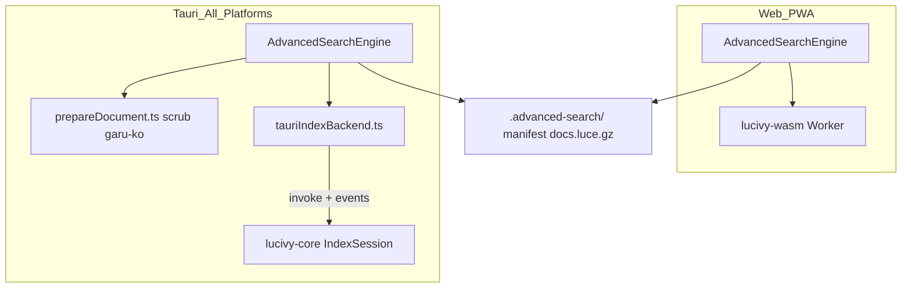
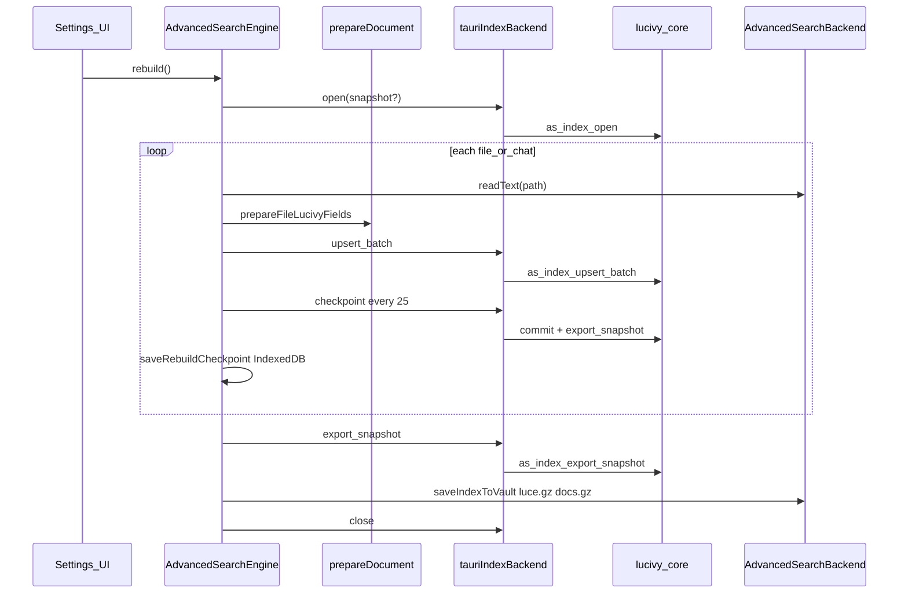

# Tauri Rust 역색인(생성·검색) 백엔드

## 배경·문제

현재 역색인은 [`src/utils/advancedSearch/lucivyBackend.ts`](src/utils/advancedSearch/lucivyBackend.ts)의 **lucivy-wasm** + OPFS + Web Worker에 의존하고, [`src/utils/advancedSearch/isolation.ts`](src/utils/advancedSearch/isolation.ts)의 `crossOriginIsolated`가 필요합니다.

| 환경 | 격리 | 현재 상태 |
|------|------|-----------|
| Vite dev / `serve.mjs` | COOP+COEP 헤더 | 동작 |
| GitHub Pages PWA | coi-serviceworker | 동작 |
| **Tauri 프로덕션** | `index.html`이 Tauri에서 coi SW 비활성 + [`tauri.conf.json`](src-tauri/tauri.conf.json)에 security headers 없음 | **lucivy-wasm 생성·검색 모두 실패 가능** |

[`engine.ts`](src/utils/advancedSearch/engine.ts)의 `rebuild()`는 isolation 실패 시 색인을 시작하지 않고, `ensureLoaded()`는 docs만 로드한 채 `lucivyReady=false`로 끝납니다.

## 목표 아키텍처

- **웹/PWA**: 기존 lucivy-wasm 경로 유지 (변경 최소).
- **Tauri 전체**: 생성·검색·증분 upsert·체크포인트 모두 Rust `lucivy-core` (npm `lucivy-wasm@^2.0.1`과 동일 LUCE v2 포맷).
- **문서 준비**(scrub, garu-ko 명사 보강): JS [`prepareDocument.ts`](src/utils/advancedSearch/prepareDocument.ts) 유지 — Rust에 garu-ko 포팅은 1차 범위 밖.

## Rust 쪽 (`src-tauri`)

### 의존성

[`src-tauri/Cargo.toml`](src-tauri/Cargo.toml)에 추가:

- `lucivy-core = "2"` (LUCE export/import, `contains` 검색 API)
- `flate2` (체크포인트 gzip — 프론트와 동일하게 raw LUCE → gzip)
- `tokio` (async invoke, 선택)

`lucivy-wasm` 2.x와 **동일 스키마** 사용 ([`LUCIVY_FIELDS`](src/utils/advancedSearch/lucivyBackend.ts)):

`title`, `body`, `path`, `kind`, `dateStr` (text)

### 모듈 구조 (신규)

| 파일 | 역할 |
|------|------|
| `src-tauri/src/as_index/mod.rs` | 세션 상태, 공통 타입 |
| `src-tauri/src/as_index/session.rs` | `LucivyHandle` 생성/열기/destroy, upsert/remove/commit |
| `src-tauri/src/as_index/commands.rs` | Tauri command + event emit |
| `src-tauri/src/as_index/search.rs` | `buildContainsAndQuery` 동등 로직 → lucivy-core search |

**작업 디렉터리**: `app_cache_dir()/as-index-work/{session_id}/` (`StdFsDirectory` / mmap). 세션 종료 시 정리.

### Tauri Commands (invoke)

| Command | 입력 | 출력 | 비고 |
|---------|------|------|------|
| `as_index_open` | `snapshot?: Vec<u8>` | `session_id` | 기존 LUCE blob import 또는 빈 인덱스 create |
| `as_index_close` | `session_id` | — | destroy + temp dir 삭제 |
| `as_index_upsert_batch` | `session_id`, `docs: [{numeric_id, fields}]` | `upserted_count` | add/update |
| `as_index_remove` | `session_id`, `numeric_id` | — | |
| `as_index_commit` | `session_id` | — | Lucivy commit |
| `as_index_export_snapshot` | `session_id` | `Vec<u8>` | raw LUCE bytes |
| `as_index_search` | `session_id`, `field`, `terms[]`, `limit` | `[{doc_id, score}]` | AND-of-contains |
| `as_index_cancel` | `session_id` | — | `AtomicBool` 플래그 |

**Progress events** (`app.emit`):

- `as-index-log` — `{ level, message }` (Rust 로컬 읽기·배치 처리 로그)
- `as-index-progress` — `{ processed, total, phase }`

[`lib.rs`](src-tauri/src/lib.rs)에 `manage(AsIndexState)` + `generate_handler![...]` 등록. 기존 `gemini_api_fetch` 패턴 참고.

### 로컬 볼트 fast path (선택·권장)

Tauri + Local Vault일 때 Rust가 직접 파일 읽기:

- Command `as_index_rebuild_local_batch`: `vault_root`, `paths[]`, `include_other`, `session_id`
- Rust: `std::fs::read` → enc.md 본문 처리는 **JS에서 `indexableEncMdBody` 호출 후 batch upsert** (암호화 노트 규칙 재사용)
- 1차: **모든 스토리지 모드에서 JS가 readText + prepare 후 batch upsert**로 단순화 → Local fast path는 2차 최적화

### Capability

[`src-tauri/capabilities`](src-tauri/capabilities)에 새 command allowlist 추가 (desktop + mobile).

## 프론트 쪽

### 1. 백엔드 어댑터

신규 [`src/utils/advancedSearch/tauriIndexBackend.ts`](src/utils/advancedSearch/tauriIndexBackend.ts):

- `isTauriIndexBackendAvailable()` → `isTauriApp()` ( [`tauriPlatform.ts`](src/utils/tauriPlatform.ts) )
- `openTauriIndexSession(snapshot?)`, `closeTauriIndexSession()`, `tauriUpsertBatch()`, `tauriCommit()`, `tauriExportSnapshot()`, `tauriSearchContainsAnd()`
- `listen('as-index-log')` / `as-index-progress` → engine build log에 연결
- `@tauri-apps/api/core` / `event` lazy import (기존 [`desktopOpenFiles.ts`](src/utils/desktopOpenFiles.ts) 패턴)

### 2. lucivyBackend 분기

[`lucivyBackend.ts`](src/utils/advancedSearch/lucivyBackend.ts)를 **얇은 팩ade**로 유지:

- Tauri: 내부적으로 `tauriIndexBackend` 호출
- Web: 기존 lucivy-wasm

또는 `indexBackend.ts` 신설 후 `buildIndex.ts` / `engine.ts` / `query` 경로가 단일 API 사용.

`buildContainsAndQuery`는 TS에 유지 → 검색 시 query JSON을 Rust에 전달하거나, Rust 쪽에 동일 AND-of-contains 빌더 구현.

### 3. engine.ts 변경 (핵심)

[`engine.ts`](src/utils/advancedSearch/engine.ts):

| 메서드 | Tauri 변경 |
|--------|------------|
| `assertIsolation` / `rebuild` gate | Tauri에서는 **isolation 체크 스킵** |
| `ensureLoaded` | Tauri: vault `luceGz` → `as_index_open` |
| `rebuildWithLucivy` | Tauri: `rebuildWithTauriIndex` — 파일/채팅 루프는 유지, `upsertFileDocument`의 `writeLucivy`가 Tauri 세션에 쓰기 |
| `persistNow` | Tauri: `export_snapshot` → 기존 [`saveIndexToVault`](src/utils/advancedSearch/store.ts) |
| `search` | Tauri: `tauriSearchContainsAnd` (WASM `lucivySearch` 대체) |
| `getStatus().isolationReady` | Tauri: 항상 `true` (또는 `nativeIndexReady` 필드 추가) |

체크포인트([`rebuildCheckpointDb.ts`](src/utils/advancedSearch/rebuildCheckpointDb.ts)): 구조 변경 없음 — `luceGz`는 여전히 JS IndexedDB에 저장, resume 시 Rust `as_index_open(gunzip(luceGz))`.

취소: `cancelRebuild()` → `as_index_cancel` + 기존 checkpoint flush 로직 유지.

### 4. UI / 설정

- [`SettingsPage.jsx`](src/pages/SettingsPage.jsx), [`StorageUsageAnalysis.tsx`](src/components/settings/StorageUsageAnalysis.tsx): Tauri에서 “COOP/COEP 필요” 메시지 숨기 / “네이티브 역색인” 표시
- [`AdvancedSearchModal.tsx`](src/components/advancedSearch/AdvancedSearchModal.tsx): `isolationReady` prop Tauri 분기
- Android AS OFF 분기 제거 예정 — [`android_tauri_sideload` 플랜](.cursor/plans/android_tauri_sideload_839ecdff.plan.md)의 `as-index-off` todo는 **취소/대체**

### 5. Advanced Search 규칙

[`settingsToggles.ts`](src/utils/advancedSearch/settingsToggles.ts) / [`commands.ts`](src/utils/advancedSearch/commands.ts): 동작 변경 없음 (핸들러는 engine 경유).

## 데이터 흐름 (풀 리빌드)

## 호환성·리스크

| 항목 | 대응 |
|------|------|
| LUCE 버전 불일치 | `lucivy-core 2.x` + `INDEX_SCHEMA_VERSION` 유지; 통합 테스트로 web↔tauri 스냅샷 교차 import |
| IPC 부하 (S3/WebDAV) | `upsert_batch` 32~64 docs, 필드 문자열만 전송; 로컬은 추후 Rust 직접 읽기 |
| Android APK 크기 | lucivy-core + tantivy 바이너리 증가 → release 빌드 후 크기 측정, 필요 시 `lto` 유지 |
| 암호화 노트 `.enc.md` | JS `indexableEncMdBody` + prepare 유지 |
| 증분 색인 | `indexFile` / `indexChatDay`도 Tauri 세션 경로 사용 (리빌드와 동일 어댑터) |

## 문서

- [`docs/advanced-search.md`](docs/advanced-search.md) §8.1: Tauri native 경로 추가, isolation 요구는 web-only로 명시
- [`README.md`](README.md): Tauri AS 동작 한 줄 보강 (선택)

## 검증 체크리스트

1. `tauri dev` — Local Vault 풀 리빌드 → 검색 본문 매칭
2. `tauri build` (macOS) — 프로덕션 번들에서 생성·검색 (COOP 없이)
3. S3 / WebDAV on Tauri — 원격 readText + Rust 인덱스
4. 리빌드 중 취소 → 체크포인트 resume / 처음부터
5. 웹/PWA — lucivy-wasm 경로 regression 없음
6. Android (에뮬레이터/실기) — 리빌드·검색 smoke (플랜 범위 확장)

## 구현 순서 (권장)

1. Rust `as_index` 세션 + open/upsert/export/search commands + events
2. `tauriIndexBackend.ts` + lucivyBackend 팩ade 분기
3. `engine.ts` isolation bypass + ensureLoaded/persist/search
4. `rebuildWithLucivy` Tauri 경로 + cancel/checkpoint
5. UI 메시지·Android AS OFF 제거
6. 문서 + 수동 검증
