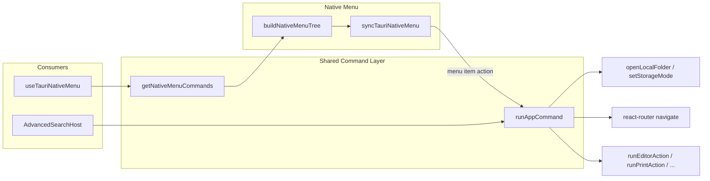

# Tauri Native App Menu Bar

## 현재 상태

- 네이티브 메뉴 구현 **없음** — [`src-tauri/src/lib.rs`](src-tauri/src/lib.rs)에 `Menu`/`on_menu_event` 없음, [`src-tauri/capabilities/default.json`](src-tauri/capabilities/default.json)에 `menu:*` 권한 없음
- Local Haim 폴더 열기: [`useVaultDomain.ts`](src/App/hooks/useVaultDomain.ts) `openLocalFolder` → `pickTauriLocalVaultDirectory()`
- Haim 전환: [`Sidebar.jsx`](src/components/shell/Sidebar.jsx) `onStorageModeChange` / `getAppNameByStorageMode()` (`S3 Haim`, `Local Haim`, `WebDAV Haim`)
- AS 명령 실행: [`AdvancedSearchHost.tsx`](src/components/advancedSearch/AdvancedSearchHost.tsx) `handleSelect`에만 분기 로직 존재 (중앙 `runAppCommand` 없음)

## 범위 (사용자 확인)

| 포함 | 제외 |
|------|------|
| AS **명령** 전부 (APP / 에디터 / 인쇄 / 채팅 / 설정 토글 / 스니펫 등) | Lucene·파일·채팅 **검색 히트** |
| File: Local Haim 폴더 선택, Haim 전환 | **Nested picker** 진입·항목 (`browse-directory`, `print-change-paper`, 각주/원숫자 picker, `chat-select-group` 등) |
| View: Advanced Search 열기 (Cmd/Ctrl+K) — picker 접근용 | |

## 아키텍처

## 1. 공통 명령 실행기 추출

**새 파일:** [`src/utils/advancedSearch/runAppCommand.ts`](src/utils/advancedSearch/runAppCommand.ts)

- `AdvancedSearchHost.handleSelect`의 `hit.kind === 'command'` 분기를 이 함수로 이전
- 입력: `commandId`, `RunAppCommandContext` (navigate, onOpenFile, onRequestCreateItem, onRequestCreateTempFile, openExportPdf, currentFile, defaultCreateParentPath, snippetConfig, path/payload 등)
- `AdvancedSearchHost`는 `handleSelect`에서 `runAppCommand(...)` 호출로 단순화
- [`src/utils/advancedSearch/index.ts`](src/utils/advancedSearch/index.ts)에 re-export

## 2. 네이티브 메뉴용 명령 목록·제외 규칙

**새 파일:** [`src/utils/advancedSearch/nativeMenuExcludedIds.ts`](src/utils/advancedSearch/nativeMenuExcludedIds.ts)

제외 ID (nested picker 및 동적 항목):

- `browse-directory`, `browse-new-file`, `browse-new-folder`
- `print-change-paper`, `print-scroll-heading`, `print-paper-*`
- `FOOTNOTE_INSERT_*` (picker 관련), `CIRCLE_NUMBER_INSERT_*`
- `chat-select-group`, `chat-select-group-item`

**새 파일:** [`src/utils/advancedSearch/getNativeMenuCommands.ts`](src/utils/advancedSearch/getNativeMenuCommands.ts)

- `getAppCommands({ ...context, includePageActions: true })` 기반으로 위 제외 목록 필터
- 컨텍스트: `editorActionsAvailable`, `printActionsAvailable`, `chatActionsAvailable`, `currentFile`, `snippetConfig`, Safari mirror-edit 제외 등 AS와 동일
- 설정 토글·탭 autosave·각주 표기 모드는 `SETTINGS_TOGGLE_DEFS` / `getWorkspaceTabsAutoSaveCommands` / `getFootnoteDisplayModeCommands`에서 별도 수집

## 3. Tauri 메뉴 빌드·동기화

**새 디렉터리:** `src/utils/tauriNativeMenu/`

| 파일 | 역할 |
|------|------|
| `menuGroups.ts` | 명령을 메뉴 그룹으로 분류 (File / Edit / Navigate / Chat / Print / Settings) |
| `buildNativeMenuTree.ts` | Tauri `Submenu`/`MenuItem`/`CheckMenuItem` 트리 정의 생성 |
| `syncTauriNativeMenu.ts` | `Menu.new` + `setAsAppMenu()` (macOS) / `setAsWindowMenu()` (Win/Linux) |

**File 메뉴 (네이티브 전용 + AS 명령)**

- `Local Haim 폴더 선택…` → `openLocalFolder()` (id: `native:local-open-folder`)
- **Haim 전환** 서브메뉴 — Check 스타일, 현재 `storageMode`에 `checked`
  - S3 Haim / Local Haim / WebDAV Haim → `setStorageMode(STORAGE_MODE_*)`
- AS 명령: `create-file`, `create-folder`, `create-temp-file`, `export-pdf`, `export-current` (컨텍스트 시)

**Edit 메뉴** — `editorActionsAvailable`일 때 필터된 `EDITOR_ACTION_COMMANDS` (각주/원숫자 picker 진입 제외)

**Navigate 메뉴** — `home`, `chat`, `chat-*` 네비, `settings` 및 `settings-*` hash 링크

**Chat 메뉴** — `chatActionsAvailable` + 채팅 관련 APP 명령

**Print 메뉴** — `printActionsAvailable`일 때만 표시, 용지 picker 제외

**Settings 메뉴** — 설정 토글을 `CheckMenuItem` (`loadSettingsToggle`로 `checked` 동기화), autosave/각주 표기는 단일 선택 그룹

**View / 고급 검색** — `requestOpenAdvancedSearch()` + accelerator `CmdOrCtrl+K`

메뉴 항목 `id`는 AS `commandId` 또는 `native:*` prefix로 `runAppCommand` / 네이티브 핸들러 분기.

## 4. React 훅 — 컨텍스트 구독·메뉴 갱신

**새 파일:** [`src/hooks/useTauriNativeMenu.ts`](src/hooks/useTauriNativeMenu.ts)

- `isTauriDesktopPlatform()` ([`tauriPlatform.ts`](src/utils/tauriPlatform.ts))일 때만 동작
- `isUnlocked` 후 1회 메뉴 생성 + 이후 debounce(≈150ms) 갱신
- 구독:
  - `subscribeEditorActions`, `subscribePrintActions`, `subscribeChatActions`, `subscribeSettingsToggles`
  - `storageMode` 변경 (VaultContext)
- `AppLayout`에서 [`VaultContext`](src/App/context/VaultContext.ts)의 `openLocalFolder`, `setStorageMode`, `storageMode`와 AS Host와 동일한 create/export 콜백을 deps로 전달

**수정:** [`src/App/components/AppLayout.tsx`](src/App/components/AppLayout.tsx) — `useTauriNativeMenu(...)` 호출

## 5. Tauri 권한

**수정:** [`src-tauri/capabilities/default.json`](src-tauri/capabilities/default.json)

[tauri-app-menu-example](https://github.com/crutchcorn/tauri-app-menu-example)과 동일하게 `menu:allow-new`, `menu:allow-set-as-app-menu`, `menu:allow-set-as-window-menu`, `menu:allow-get`, `menu:allow-set-enabled`, `menu:allow-set-checked`, `menu:allow-set-text` 등 필요 권한 추가 (`platforms`: linux, macOS, windows 유지)

Rust [`Cargo.toml`](src-tauri/Cargo.toml) menu feature는 **불필요** — JS Menu API 사용.

## 6. 플랫폼 메모

- **macOS:** `menu.setAsAppMenu()` — 글로벌 menubar
- **Windows/Linux:** `menu.setAsWindowMenu(getCurrentWindow())` — 커스텀 titlebar 환경과 호환
- Android/iOS Tauri: 훅 early return (데스크톱 전용)

## 검증 체크리스트

1. `tauri:dev` (macOS 또는 Windows)에서 메뉴바 표시 확인
2. File → Local Haim 폴더 선택 → 다이얼로그 → 트리 갱신
3. File → Haim 전환 3종 → 사이드바 저장소 모드와 동기화
4. 에디터 열림 시 Edit 메뉴 항목 활성 + bold 등 실행
5. `/export-pdf`에서 Print 메뉴 표시, save/export 등 실행
6. 설정 토글 Check 항목 클릭 → Settings UI와 상태 일치
7. `browse-directory` / 용지 변경 / 각주 picker 항목이 메뉴에 **없음**
8. View → Advanced Search → Cmd+K 팔레트 열림 (picker는 AS에서만)
