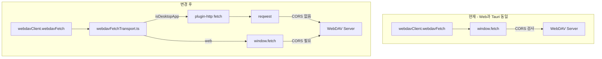

# Tauri WebDAV CORS 우회 (`@tauri-apps/plugin-http`)

## 배경

현재 WebDAV는 [`src/utils/webdavClient.js`](src/utils/webdavClient.js)의 `webdavFetch()`가 **항상 WebView `fetch`** 를 사용합니다. Tauri Origin(`https://tauri.localhost`, dev 시 `http://localhost:5173`)은 웹 배포 Origin과 달라 CORS에 막히며, macOS WKWebView는 `Load failed`만 반환합니다.

Gemini는 [`src/utils/geminiApiTransport.ts`](src/utils/geminiApiTransport.ts) + Rust `gemini_api_fetch`로 우회하지만, WebDAV는 **사용자가 임의 URL을 입력**하므로 고정 Origin Rust 커맨드보다 [Tauri HTTP Client 플러그인](https://v2.tauri.app/plugin/http-client/)이 적합합니다. 플러그인 fetch는 Web API와 호환되며 **브라우저 CORS를 거치지 않고** Rust `reqwest`로 직접 요청합니다.



## 구현 전략

### 1. 플러그인 설치 및 Rust 설정

- `bun tauri add http` (또는 수동으로 `@tauri-apps/plugin-http` + `tauri-plugin-http`)
- [`src-tauri/Cargo.toml`](src-tauri/Cargo.toml):

```toml
tauri-plugin-http = { version = "2", features = ["unsafe-headers", "dangerous-settings"] }
```

| Feature | 이유 |
|---------|------|
| `unsafe-headers` | `Authorization`(Basic Auth), `Depth`, `Destination`, `Overwrite` 등 WebDAV 필수 헤더 — 미설정 시 플러그인이 헤더를 **무시**함 ([공식 문서](https://v2.tauri.app/plugin/http-client/)) |
| `dangerous-settings` | 사용자 선택 시 `acceptInvalidCerts`로 자체서명 TLS 허용 |

- [`src-tauri/src/lib.rs`](src-tauri/src/lib.rs): `.plugin(tauri_plugin_http::init())` 등록

### 2. Capability URL scope (임의 WebDAV 엔드포인트)

WebDAV endpoint는 빌드 시점에 알 수 없으므로 `http`/`https` 전역 패턴 허용. Tauri v2는 **포트 명시 URL**에 별도 패턴이 필요합니다 ([#2131](https://github.com/tauri-apps/plugins-workspace/issues/2131)).

[`src-tauri/capabilities/default.json`](src-tauri/capabilities/default.json) 및 [`src-tauri/capabilities/mobile.json`](src-tauri/capabilities/mobile.json)에 추가:

```json
{
  "identifier": "http:default",
  "allow": [
    { "url": "http://*" },
    { "url": "https://*" },
    { "url": "http://*:*" },
    { "url": "https://*:*" }
  ]
}
```

**보안 트레이드오프**: 데스크톱 WebDAV 클라이언트 특성상 불가피. 요청은 여전히 사용자가 저장한 endpoint로만 발생하며, `file://` 등 비 HTTP 스킴은 scope에 포함하지 않음.

### 3. Fetch transport 레이어 (신규)

신규 [`src/utils/webdavFetchTransport.ts`](src/utils/webdavFetchTransport.ts):

```ts
import { isDesktopApp } from '@/utils/isDesktopApp';

export type WebdavFetchInit = RequestInit & {
  /** Tauri only — passed as plugin-http ClientOptions.danger */
  acceptInvalidCerts?: boolean;
};

export async function webdavHttpFetch(url: string, init: WebdavFetchInit): Promise<Response> {
  if (!isDesktopApp()) {
    const { acceptInvalidCerts: _, ...webInit } = init;
    return fetch(url, webInit);
  }
  const { fetch } = await import('@tauri-apps/plugin-http');
  const { acceptInvalidCerts, ...rest } = init;
  return fetch(url, {
    ...rest,
    ...(acceptInvalidCerts
      ? { danger: { acceptInvalidCerts: true, acceptInvalidHostnames: true } }
      : {}),
  });
}
```

- `isDesktopApp()` 게이트 + dynamic import → 웹 빌드 번들에서 플러그인 제외 ([`vite-chunk-splitting`](.cursor/rules/vite-chunk-splitting.mdc))
- `AbortSignal`은 플러그인 fetch가 지원함

### 4. `webdavClient.js` 연동

[`src/utils/webdavClient.js`](src/utils/webdavClient.js) `webdavFetch()`:

- `fetch` → `webdavHttpFetch` 교체
- `WebdavConfig`에 `acceptInvalidCerts?: boolean` 추가 후 transport에 전달
- 네트워크 에러 매핑에 `Load failed` 추가 (WKWebView 대비, 웹 경로용):

```js
if (/Failed to fetch|NetworkError|Load failed|CORS/i.test(msg)) { ... }
```

WebDAV 메서드(`PROPFIND`, `MKCOL`, `MOVE`, `COPY`)와 `response.blob()` / `response.text()` 사용은 플러그인 fetch Web API 호환으로 **기존 로직 유지**.

### 5. 설정: 자체서명 인증서 토글 (Tauri 전용)

[`src/utils/storageSettings.js`](src/utils/storageSettings.js):

- `DEFAULT_WEBDAV_CONFIG`에 `acceptInvalidCerts: false` 추가
- `normalizeWebdavConfig()`에 boolean 필드 정규화

[`src/pages/SettingsPage.jsx`](src/pages/SettingsPage.jsx) WebDAV 폼:

- `isDesktopApp()`일 때만 Radix `Switch` 표시 — 라벨 예: `자체서명 TLS 인증서 허용 (Tauri 전용)`
- `webdavForm.acceptInvalidCerts` 저장/테스트에 포함

이 토글은 WebDAV 연결 설정의 일부이므로 Advanced Search settings toggle 등록은 **불필요** (전역 설정 스위치가 아님).

### 6. 에러 메시지 정리

[`src/pages/SettingsPage.jsx`](src/pages/SettingsPage.jsx) 연결 테스트 `catch`:

- **Tauri**: CORS 안내 대신 `네트워크·인증·TLS(자체서명 토글) 확인` 안내
- **웹**: 기존 CORS 안내 유지

[`README.md`](README.md) WebDAV CORS 섹션에 Tauri는 plugin-http로 CORS 불필요함을 한 줄 추가.

## 변경 파일 요약

| 파일 | 변경 |
|------|------|
| `package.json` | `@tauri-apps/plugin-http` 의존성 |
| `src-tauri/Cargo.toml` | `tauri-plugin-http` + features |
| `src-tauri/src/lib.rs` | 플러그인 init |
| `src-tauri/capabilities/default.json` | `http:default` scope |
| `src-tauri/capabilities/mobile.json` | 동일 (Android WebDAV 대비) |
| `src/utils/webdavFetchTransport.ts` | **신규** transport |
| `src/utils/webdavClient.js` | transport 사용 + 에러 매핑 |
| `src/utils/storageSettings.js` | config 필드 확장 |
| `src/pages/SettingsPage.jsx` | TLS 토글 + 에러 copy |
| `README.md` | Tauri CORS 면제 문서화 |

## 검증 체크리스트

1. **Tauri dev** (`bun run tauri:dev`): CORS 미설정 WebDAV → 연결 테스트 성공
2. **Tauri release build**: `https://tauri.localhost` Origin에서도 동일
3. **웹 브라우저**: 기존 동작 유지 (CORS 필요)
4. **PROPFIND / MKCOL / MOVE**: 트리 목록·폴더 생성·이동
5. **자체서명 TLS**: 토글 OFF → 실패, ON → 성공
6. **Basic Auth**: `unsafe-headers` 없이는 401 루프 — feature 활성화 후 정상

## 하지 않는 것 (범위 밖)

- S3 presigned URL / LLM endpoint CORS 우회 (별도 과제)
- WebDAV OAuth
- 서버 CORS 설정 자동화
