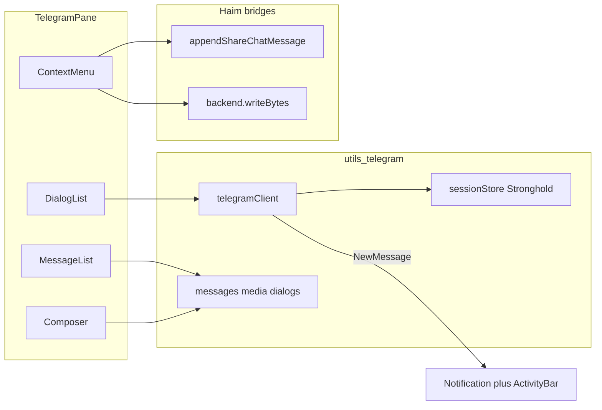

# Telegram (GramJS) messenger — Tauri only

## Decisions (locked)

- **Platform**: Tauri desktop only. Web builds show settings copy + `/telegram` gate (“데스크톱 앱에서만 사용 가능”); no MTProto client on web.
- **Credentials**: User enters `api_id` / `api_hash` from [my.telegram.org](https://my.telegram.org); phone + code (+ 2FA) login via GramJS `client.start`.
- **UI surface**: Separate quasi-page `/telegram` (not merged into 「나와의 채팅」), lazy-loaded like chat.
- **Haim bridges**: Context menu → share into Chat-with-Myself; context menu → download media into vault Tree folder.

## Architecture

### Client layer — `src/utils/telegram/`

| Module | Role |
|--------|------|
| `telegramClient.ts` | Singleton `TelegramClient` lifecycle: connect / disconnect / reconnect; only when `isDesktopApp()` |
| `sessionStore.ts` | Persist `apiId`, `apiHash`, `StringSession` via Stronghold ([`desktopStrongholdSecrets.ts`](src/utils/shared/desktopStrongholdSecrets.ts)); clear on logout |
| `dialogs.ts` | `getDialogs` → chat list model |
| `messages.ts` | History (`getMessages` + pagination), send, reply (`replyTo`), forward (`forwardMessages`) |
| `media.ts` | Send file/photo; `downloadMedia` → `Uint8Array` / `Blob` (not OS download by default) |
| `chats.ts` | Create group / channel via GramJS TL helpers |
| `events.ts` | `NewMessage` → in-app activity + OS `Notification` when unfocused |
| `shareToChat.ts` | Map Telegram text/media → [`appendShareChatMessage`](src/utils/chatWithMyself/shareSend.js) |
| `saveToVault.ts` | Download media buffer → `createStorageBackend(...).writeBytes(destPath)` after folder pick |

Depend on npm `telegram` (GramJS). Dynamic `import('telegram')` only from Telegram modules so cold start stays lean.

### Vite / bundle

- Lazy route only; add `vendor-telegram` in [`vite.config.ts`](vite.config.ts) `manualChunks` for `/node_modules/telegram/`.
- Add WebView polyfills if GramJS requires them (`buffer` / `process` via Vite `optimizeDeps` / `define`).

### UI — `src/components/telegram/`

- `TelegramPane.tsx` — dialog list | thread | composer
- `TelegramLoginModal.tsx` — api credentials (if missing), phone, code, 2FA (modal sticky chrome)
- `TelegramDialogList.tsx` — chats + unread
- `TelegramMessageList.tsx` — history + load older
- `TelegramComposer.tsx` — text, attach, reply chip
- `TelegramMessageContextMenu.tsx` — AdaptiveContextMenu / MobileContextMenuModal:
  - 답장
  - 다른 채팅으로 전달
  - **나와의 채팅으로 공유**
  - **Vault Tree에 저장** (media/docs)
- `TelegramForwardModal.tsx` — pick dialog → `forwardMessages`
- `TelegramCreateChatModal.tsx` — create group / channel (title + type)
- `TelegramSaveToVaultModal.tsx` — folder picker patterned on [`KanbanFolderPickerModal.tsx`](src/components/kanban/KanbanFolderPickerModal.tsx) + `saveToVault`
- `TelegramDesktopGate.tsx` — web placeholder

Long-press → `vibrateLongPressAction()`; nested portals `z-100010+`.

### App wiring

- Path `/telegram` + workspace tab `TELEGRAM_TAB_ID` in [`workspaceTabs/types.ts`](src/utils/workspaceTabs/types.ts)
- Lazy mount in [`WorkspaceMainPanels.tsx`](src/components/shell/workspace/WorkspaceMainPanels.tsx)
- Sidebar 「Telegram」 (desktop only)
- [`routeEntries.ts`](src/pages/routeEntries.ts): `FEATURE_QUASI_PAGES`
- Settings `integrations` → `settings-telegram` in [`settingsPageCatalog.ts`](src/utils/settingsPageCatalog.ts): api_id/hash, connect/logout; web shows desktop-only note
- Advanced Search: `telegram-open` (+ composer focus when mounted)
- `ActivityTypes.TELEGRAM_*` in [`ActivityIndicatorContext.tsx`](src/contexts/ActivityIndicatorContext.tsx)

### Feature map

| Requirement | Implementation |
|-------------|----------------|
| Chat forward | `forwardMessages` + Forward modal |
| Send/receive | `sendMessage` + `NewMessage` |
| Notifications | Unfocused `Notification`; in-app ActivityIndicator + unread |
| History | `getMessages` pagination |
| File send | Composer `sendFile` |
| File download | Vault save primary via `downloadMedia` → bytes; optional OS download secondary |
| Group / channel create | Create modal |
| Reply | Composer `replyTo` + menu |
| Share to Chat-with-Myself | Menu → media as File(s) + text → `appendShareChatMessage` |
| Save to Tree | Menu → folder picker → `writeBytes` → tree refresh |

### Security

- Never log api_hash or session string.
- Session only in Stronghold; logout wipes it.
- Settings note: user-owned API credentials + Telegram terms.
- No server MTProto proxy.

### Out of scope

- Web GramJS connection, multi-account, calls/stories/stickers deep UX, auto-mirroring all Telegram history into vault day-files.

## Implementation order

1. Deps + Vite chunk/polyfill + sessionStore + telegramClient connect/login/logout
2. Settings + desktop gate + `/telegram` shell + sidebar/tab/AS
3. Dialogs + history + send + reply
4. NewMessage + notifications + unread
5. File send/download + forward + create group/channel
6. Context menu bridges: Chat-with-Myself share + Vault Tree save
7. Activity bar, empty/error states, disconnect on app logout
