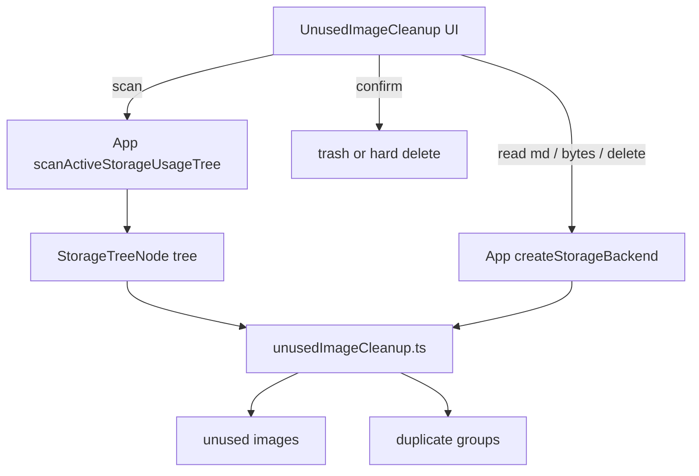

# Unused / Duplicate Image Cleanup

## Scope (확정)

- 위치: [`SettingsPage.jsx`](src/pages/SettingsPage.jsx)의 [`StorageUsageAnalysis`](src/components/settings/StorageUsageAnalysis.tsx) **바로 아래**
- **대상 스코프 (UI 선택)**
  - `notes`: `.images/` 만
  - `notes+chat`: `.images/` + `.chat-with-myself/images/`
- **삭제 방식 (UI 선택, 기본값 `trash`)**
  - `trash`: `backend.trash(path)` — 앱 일반 삭제와 동일
  - `hard`: `backend.delete(path)` — 영구 삭제
- **참조 파싱**: 위키 `![[path]]`만 (`WIKI_IMAGE_RE` + `parseWikiImageInner` in [`wikiImageSyntax.js`](src/utils/wikiImageSyntax.js)). 표준 ``는 에디터가 쓰지 않으므로 제외
- **중복**: 동일 바이트(SHA-256) 그룹. size로 1차 버킷팅 후 2개 이상만 해시

## Architecture

## New files

### 1. [`src/utils/unusedImageCleanup.ts`](src/utils/unusedImageCleanup.ts)

순수 분석 + 경로 규칙:

- `IMAGE_EXTS` / prefix helpers: `.images/`, `.chat-with-myself/images/`
- `collectImageFiles(tree, scope)` — `.trash/` 제외, 스코프별 prefix + 이미지 확장자
- `collectMarkdownPaths(tree)` — `.md`, `.trash/` 제외 (채팅 일별 md 포함 — 스코프가 notes+chat일 때 채팅 이미지 참조를 잡기 위함; notes-only여도 md는 전부 읽어 `.images/` 참조만 매칭)
- `extractWikiImagePaths(markdown)` — `WIKI_IMAGE_RE` + path normalize (`decodeURIComponent`, leading `/` 제거)
- `findUnusedImages({ images, referencedPaths })` — 정규화 path set 차집합
- `findDuplicateImageGroups(files, readBytes)` — size≥1 버킷 → `crypto.subtle.digest('SHA-256')` → 해시당 2+ 파일 그룹. 진행률 콜백 지원
- `formatStorageBytes`는 기존 [`storageUsageAnalysis.ts`](src/utils/storageUsageAnalysis.ts) 재사용

### 2. [`src/components/settings/UnusedImageCleanup.tsx`](src/components/settings/UnusedImageCleanup.tsx)

[`StorageUsageAnalysis`](src/components/settings/StorageUsageAnalysis.tsx)와 비슷한 섹션 톤:

- 헤더: 「미사용 / 중복 이미지」
- 옵션 행:
  - 대상: 라디오 `노트만` / `노트 + 채팅`
  - 삭제: 라디오 `휴지통으로 이동`(기본) / `영구 삭제`
- 액션: `미사용 스캔` / `중복 스캔` (각각 독립 실행; 중복은 다운로드·해시라 비용이 커서 분리)
- 진행 표시: md N/M 읽기, 해시 N/M
- 결과 탭/섹션:
  - **미사용**: 체크리스트(전체 선택), path·size, 선택 삭제
  - **중복**: 그룹별 리스트, 그룹 내 “남길 1개” 제외 나머지 선택(기본: 경로 사전순 첫 파일 keep), 선택 삭제
- 삭제 전 [`ConfirmModal`](src/components/modals/ConfirmModal.jsx): 건수 + 삭제 방식 문구
- Props: `storageMode`, `canScan`, `onScanTree`, `onReadText`, `onReadBytes`, `onDeletePaths`, `onGetObjectUrl?` (썸네일 가능하면 선택적; v1은 path·size만으로도 OK, URL 있으면 작은 미리보기)

## App / Settings wiring

[`App.jsx`](src/App.jsx) + [`SettingsPage.jsx`](src/pages/SettingsPage.jsx):

- 기존 `scanActiveStorageUsageTree` / `canScanStorageUsage` 재사용
- `createStorageBackend({ mode, getS3Client, s3Creds, localRootHandle, webdavConfig })`로:
  - `onReadText(path) => backend.readText(path)`
  - `onReadBytes(path) => backend.readBytes(path)`
  - `onDeletePaths(paths, mode)` → 순회 `trash` 또는 `delete`; 일부 실패 시 실패 목록 반환 후 트리 새로고침(`loadS3Files` / local / webdav refresh)
- Settings에 `<UnusedImageCleanup ... />`를 StorageUsageAnalysis 다음에 배치

## Scan pipeline (미사용)

1. `onScanTree()`로 전체 트리
2. 스코프에 맞는 이미지 파일 수집
3. 모든 `.md` path 수집 → `readText`로 본문 로드 (동시성 제한 ~4~8)
4. 각 md에서 wiki image path 추출 → `Set`
5. 이미지 path ∉ Set → 미사용 목록 (size 내림차순)

채팅 스코프 시: `.chat-with-myself/*.md`의 `![[.chat-with-myself/images/...]]`도 같은 파서로 포함.

## Duplicate pipeline

1. 동일 스코프 이미지 목록
2. `size` 동일·size>0 버킷만 후보
3. 버킷 내 `readBytes` → SHA-256 hex
4. 동일 해시 그룹만 UI 표시; 그룹당 최소 1개 keep 강제

## Safety / edge cases

- `.trash/` 하위는 이미지·md 모두 스캔 제외
- path 정규화로 `![[/foo]]` vs `foo` 불일치 방지
- 스캔 중 언마운트/재스캔 시 AbortSignal로 취소
- 영구 삭제 선택 시 Confirm 문구를 더 강하게
- 대량 md/이미지: 진행률만 표시, 그래프/차트 없음
- 코드 주석·식별자는 영어 (한글 UI 라벨만)

## Out of scope (이번 PR)

- 노트 삭제 시 `.images/` 자동 동반 trash
- 표준 markdown image URL orphan
- IndexedDB 캐시(`wikiImageCacheDb`) 정리 (삭제 후 다음 resolve 시 자연 만료에 맡김)
