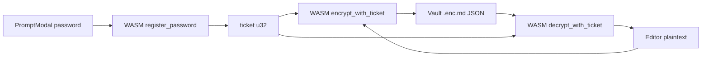

# WASM ticket crypto for `.enc.md`

## Goals

- JS에 **비밀번호 문자열을 세션 캐시하지 않음** (현재 [`encMd.ts`](src/utils/encMd.ts) `Map<path, password>` 제거).
- PromptModal에서 받은 암호는 **WASM에 1회 이관** → 내부 보관 → **ticket(`u32`)** 반환 → JS 쪽 암호 버퍼는 가능한 한 즉시 폐기.
- 이후 저장/열기: **ticket + data**만 WASM에 전달.
- Vault wire는 기존과 동일: `{ ciphertext, iv, salt }` base64 JSON ([`crypto.js`](src/utils/crypto.js) PBKDF2 100000 / SHA-256 / AES-GCM-256).

## Honest limits (document in `enc-md.md`)

WASM은 TEE가 아님. linear memory는 디버거/XSS로 읽을 수 있음. 목표는 **실수로 JS heap·IndexedDB·Map에 암호가 남는 경로를 제거**하는 것. Ticket 자체는 JS에 남되, 암호/키 material export API는 두지 않음.

## Architecture



### WASM exports (Rust + `wasm-bindgen`)

| Export | Behavior |
|--------|----------|
| `register_password(pw: string) -> u32` | Copy UTF-8 into private slot, wipe input copy where feasible, return ticket. Never export password. |
| `encrypt_with_ticket(ticket, plaintext) -> string` | PBKDF2+AES-GCM → wire JSON string. Invalid ticket → throw. |
| `decrypt_with_ticket(ticket, ciphertext_json) -> string` | Inverse. Wrong password/payload → throw. |
| `revoke_ticket(ticket)` | Zeroize slot, free ticket. |
| `revoke_all()` | Clear all slots (logout / page teardown). |

Internal store: `HashMap<u32, Vec<u8>>` (password bytes). **v1 stores password bytes only**, derive per encrypt/decrypt to match current JS (each encrypt picks new salt).

Crypto crates: `pbkdf2` + `sha2` + `aes-gcm` + `getrandom` (same params as `generateKey` / `encryptData`). Base64 encode salt/iv/ciphertext like JS `bufToBase64`.

### JS facade

New: [`src/utils/encMdCryptoWasm.ts`](src/utils/encMdCryptoWasm.ts) (lazy `import()` of wasm glue — vite chunk split).

```ts
ensureEncMdCrypto(): Promise<void>
registerEncMdPassword(password: string): Promise<number>  // ticket
encryptWithTicket(ticket: number, plaintext: string): Promise<string>
decryptWithTicket(ticket: number, body: string): Promise<string>
revokeTicket(ticket: number): void
revokeAllTickets(): void
```

Path↔ticket map만 JS에 유지: `Map<path, ticket>` in [`encMd.ts`](src/utils/encMd.ts) — **비밀번호 없음**.

Replace:

- `setEncMdPassword` → `bindEncMdTicket(path, ticket)` / `register` helper that returns ticket
- `getEncMdPassword` → `getEncMdTicket(path)`
- `clearEncMdPassword` → `revoke` ticket + delete map entry
- `tryUnlockEncMdContent` / `prepareEncMdVaultBody` → ticket APIs
- Remove direct `encryptData`/`decryptData` usage from enc.md path (chat encrypted messages stay on JS `crypto.js`)

### App wiring ([`App.jsx`](src/App.jsx))

- Create / unlock PromptModal: `registerEncMdPassword(pw)` → bind path → **do not** keep `password` in module state.
- Save: `encryptWithTicket(getEncMdTicket(path), plaintext)`; no ticket → prompt → register → encrypt.
- Open: if ticket exists try decrypt; else prompt → register → decrypt (verify) → bind.
- Tab close / logout: revoke ticket.

[`openPathFileFromBackend.js`](src/utils/storage/openPathFileFromBackend.js): keep `tryUnlockEncMdContent` signature but implement via ticket.

## Build / repo layout

```
crates/enc-md-crypto/     # Rust source (committed) + Cargo.lock (committed for CI reproducibility)
  Cargo.toml
  src/lib.rs
src/wasm/enc-md-crypto/   # wasm-pack output (NOT committed; CI + local script generate)
```

- `package.json`:
  - `"build:enc-md-wasm": "wasm-pack build ./crates/enc-md-crypto --target bundler --release --out-dir ../../src/wasm/enc-md-crypto"`
  - Prefixed onto existing `build` (and document that `dev` needs one local wasm build first, or a small predev hook).
- Vite: already `assetsInclude: ['**/*.wasm']`; facade lazy-imports bundler glue.
- **Do not commit** generated `.wasm` / JS glue — always built by `build:enc-md-wasm` (local) or CI before `bun run build`.

## `.gitignore` (Rust / wasm-pack)

Append to [`.gitignore`](.gitignore):

```gitignore
# Rust
**/target/
**/*.rs.bk

# wasm-pack generated (rebuild via bun run build:enc-md-wasm)
src/wasm/enc-md-crypto/
crates/enc-md-crypto/pkg/
```

Keep `crates/enc-md-crypto/Cargo.lock` tracked. Do **not** ignore the Rust sources under `crates/enc-md-crypto/src/`.

## CI / GitHub Actions

Repo today: Bun + [`deploy.yml`](.github/workflows/deploy.yml) (Pages on `main`). Adapt the provided WASM+Vite workflow to **Bun** (not `npm ci` / `npm run build`) and crate path `./crates/enc-md-crypto`.

### 1) New PR/push build workflow — [`.github/workflows/build.yml`](.github/workflows/build.yml)

Trigger: `push` to `main`/`develop`, `pull_request` to `main`. Job steps (order fixed):

1. `actions/checkout@v4`
2. `oven-sh/setup-bun@v1` (match deploy; not setup-node/npm)
3. `dtolnay/rust-toolchain@stable` with `targets: wasm32-unknown-unknown`
4. `Swatinem/rust-cache@v2` (workspaces: `crates/enc-md-crypto`)
5. `jetli/wasm-pack-action@v0.4.0` (`version: latest`)
6. **Build WASM**: `wasm-pack build ./crates/enc-md-crypto --target bundler --release --out-dir ../../src/wasm/enc-md-crypto` (cwd-aware; equivalent to `bun run build:enc-md-wasm`)
7. `bun install` (+ `bun install --cwd docs` if full app build needs docs)
8. `bun run build` with same env as deploy when verifying Pages output (`VITE_BASE_PATH` optional on PR; use repo name or `/` — deploy keeps Pages path)

PR job verifies `dist/index.html` (and docs if included) like deploy’s verify step; **no** gh-pages publish.

### 2) Extend [`deploy.yml`](.github/workflows/deploy.yml)

Insert the same Rust toolchain + rust-cache + wasm-pack + **Build WASM** steps **after** checkout / Bun setup and **before** `bun run build`, so Pages never ships without a fresh wasm artifact.

Concrete insert order after Setup Bun:

- rust-toolchain (wasm32)
- rust-cache
- wasm-pack-action
- Build WASM (`bun run build:enc-md-wasm` or raw `wasm-pack …`)
- existing Install dependencies
- existing Build / Verify / Deploy

## Compatibility

- Existing vault files decrypt with same PBKDF2/AES-GCM wire → no migration.
- Interop test: fixture from JS `encryptData` decrypts via WASM; WASM encrypt decrypts via JS `decryptData`.

## Docs

Update [`docs/custom-markdown/enc-md.md`](docs/custom-markdown/enc-md.md): session = ticket in JS + password in WASM; non-goal = TEE; local `bun run build:enc-md-wasm`; CI builds wasm before Vite.

## Out of scope

- Chat encrypted messages (keep JS)
- Changing vault JSON schema
- WebAuthn PRF / hardware-backed keys
- Auto-save for `.enc.md` (already disabled)
