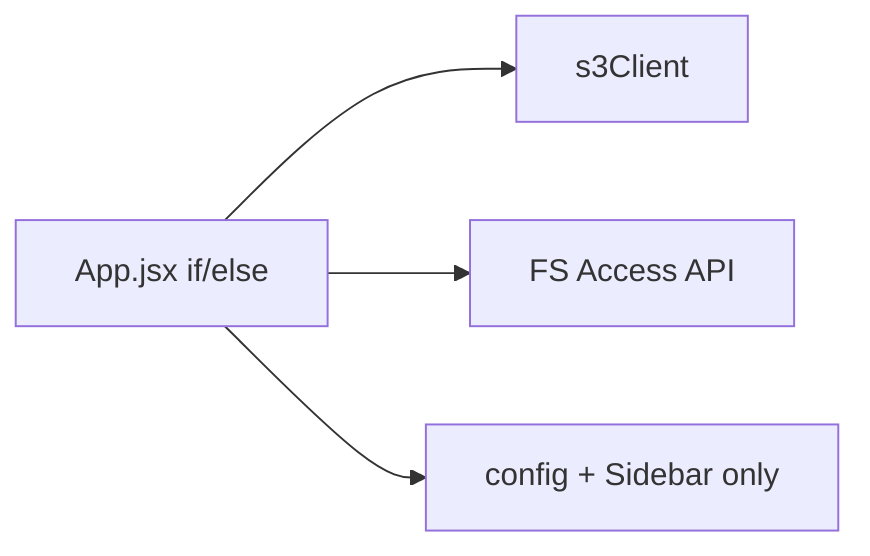
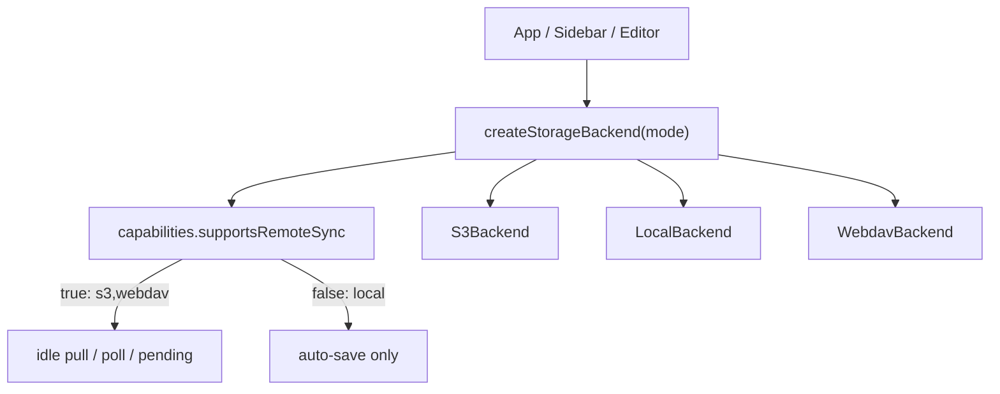

# WebDAV 지원 + Local/S3 기능 동등화 계획

## 전제 (확정 기본값)

- **기기 간 데이터 동기화** = idle pull(30s), 모바일 LastModified 폴링, `pendingUploadsDb` 원격 재업로드, 녹음 네트워크 드레인. 이는 **S3 + WebDAV만** 유지.
- Local은 위 sync를 제외한 **모든 UX 기능**을 S3와 동일하게 (녹음·이미지·휴지통·텍스트로 보기·미디어 새 창 등).
- WebDAV 클라이언트: npm [`webdav`](https://github.com/perry-mitchell/webdav-client) (`createClient` from `webdav/web`), Basic/Digest auth.
- CORS: **1차 = 브라우저 직접 호출 + 서버 CORS 필수 문서화**. Electron/로컬 프록시는 후속 단계로만 명시.
- 나와의 채팅: **노트/파일 I/O 완성 후 마지막 단계**로 WebDAV 연동 (그 전엔 WebDAV 모드에서 채팅이 S3로 잘못 가지 않도록 가드).

## 현황

- 공통 Storage 추상화 없음. I/O 분기가 [`App.jsx`](src/App.jsx)(~4600 LOC)에 집중.
- WebDAV: [`storageSettings.js`](src/utils/storageSettings.js) 설정 + [`Sidebar.jsx`](src/components/Sidebar.jsx) 플레이스홀더만.
- Local 최대 공백: 녹음 파이프라인(`noteKey=''`), unsupported 텍스트 보기, 미디어 새 창 blob, settings 로드가 S3 우선.

## 목표 아키텍처

공통 인터페이스 (신규 [`src/utils/storage/StorageBackend.js`](src/utils/storage/StorageBackend.js) JSDoc + 팩토리):

| 메서드 | 용도 |
|--------|------|
| `listTree` / `listChildren` | 사이드바 트리 (S3: full list, Local/WebDAV: lazy 가능) |
| `readBytes` / `readText` + `head` | 열기, settings, sync.pb |
| `writeBytes` / `writeText` | 저장, 업로드, 이미지, 녹음 |
| `mkdir`, `delete`, `copy`, `move` | CRUD |
| `trash` / `ensureTrash` | `.trash/` 공통 규칙 |
| `getObjectUrl` | signed / blob / (WebDAV는 auth fetch→blob URL) |
| `uploadWithProgress` | 대용량·녹음 |
| `capabilities` | `{ supportsRemoteSync, supportsLazyTree, label, icon }` |

구현체:
- [`src/utils/storage/s3Backend.js`](src/utils/storage/s3Backend.js) — 기존 [`s3Client.js`](src/utils/s3Client.js) / [`s3Tree.js`](src/utils/s3Tree.js) 래핑
- [`src/utils/storage/localBackend.js`](src/utils/storage/localBackend.js) — [`localTree.js`](src/utils/localTree.js) / [`localFolderStore.js`](src/utils/localFolderStore.js) / [`localEditorImage.js`](src/utils/localEditorImage.js)
- [`src/utils/storage/webdavBackend.js`](src/utils/storage/webdavBackend.js) + [`webdavClient.js`](src/utils/webdavClient.js) — PROPFIND/GET/PUT/MKCOL/DELETE/MOVE/COPY

`currentFile.type`을 `'s3' | 'local' | 'webdav'`로 확장하고, 기능 게이트는 `type === 'x'` 대신 **`backend.capabilities` / `storageMode`** 기준으로 통일.

---

## Phase 1 — Local ↔ S3 기능 동등화 (sync 제외)

목표: Local에서 “동작해야 하는데 안 되는” 항목 제거.

1. **녹음**
   - `handleToggleRecording`: Local도 `noteKey = currentFile.id`
   - [`recordingPipeline.js`](src/utils/recordingPipeline.js): backend `writeBytes`로 `…-rec-{ts}.m4a` + `.sync.pb`를 노트 옆 경로에 기록 (S3는 기존 put, Local은 FS, WebDAV는 이후 PUT)
   - 목록: `getRecordingKeysFromTree`를 local/webdav 트리에도 적용
   - 재생: `getObjectUrl` → Local blob URL
   - 삭제 시 `associatedRecordings`: `type !== 's3'` → `[]` 제거, 활성 백엔드 기준

2. **unsupported → 텍스트로 보기** — Local `handle.getFile().text()` 경로 ([`App.jsx`](src/App.jsx) ~2109)

3. **미디어 새 창** — Local도 blob URL로 탭 오픈 ([`App.jsx`](src/App.jsx) ~1855)

4. **저장 실패 durability** — Local은 `pendingUploadsDb` 대신 `saveMemoDraft` + 재시도 안내 (원격 pending과 분리)

5. **`.settings` 로드** — `storageMode === 'local'`이면 로컬 루트만 읽기 (잔존 S3 creds 무시). Print/snippets 동일 ([`printSettingsStore.js`](src/utils/printSettingsStore.js), App snippets load ~932)

이 단계에서 recording pipeline이 “backend에 쓰기” 형태가 되면 Phase 3 WebDAV 녹음이 거의 공짜로 따라옴.

---

## Phase 2 — StorageBackend 추출

1. 인터페이스 + `createStorageBackend({ mode, s3Creds, localRootHandle, webdavConfig })`
2. S3/Local 어댑터로 기존 동작을 이전 (행동 변경 최소화, App 분기만 치환)
3. Sidebar “ready” 조건: `(s3&&bucket) || (local&&handle) || (webdav&&endpoint)`
4. Editor 아이콘/상태바: `backend.capabilities` (Cloud / Folder / WebDAV 아이콘)
5. DnD·Move 모달: `storageType`에 `webdav` 추가, **같은 mode끼리만** 이동 유지

점진 이전: 한 핸들러씩(open/save → CRUD → image → recording) 어댑터로 옮기고, 회귀는 S3/Local 수동 스모크.

---

## Phase 3 — WebDAV 백엔드 구현

1. 의존성: `webdav` 추가 (`bun` 기준)
2. [`webdavClient.js`](src/utils/webdavClient.js): `createClient(endpoint, { username, password })`, `basePath` join 유틸
3. 트리: `getDirectoryContents` 기반 lazy tree (Local과 유사 UX). 노드 shape을 Local과 맞춤 (`path`, `name`, `type`, childrenLoaded) — handle 대신 remote path
4. CRUD / trash `.trash/` / 폴더 업로드 / ZIP 다운로드를 backend 메서드로 구현
5. `getObjectUrl`: GET → Blob → `URL.createObjectURL` (인증 필요 리소스; wiki/녹음/미디어 공용)
6. Sidebar: WebDAV 플레이스홀더 제거, 트리 + 새로고침/업로드/생성 연결
7. 설정: 연결 테스트 버튼 (`getDirectoryContents(basePath || '/')`)
8. **CORS**: Settings/README에 Nextcloud 등 CORS 헤더 요구사항 명시. 실패 시 명확한 에러 메시지.

자격증명: plaintext [`s3haim_webdav_config`](src/utils/storageSettings.js) → **S3와 동일 암호화 blob**으로 이관 (마스터비번/WebAuthn). 마이그레이션: 평문 있으면 다음 unlock 시 암호화 후 평문 키 삭제.

---

## Phase 4 — 원격 동기화 (S3 + WebDAV만)

`capabilities.supportsRemoteSync === true`일 때만:

| 기능 | 동작 |
|------|------|
| Idle 30s pull | `head`/`lastModified` 비교 후 열린 md 덮어쓰기 |
| 모바일 폴링 | 동일 |
| `pendingUploadsDb` | 네트워크 저장 실패 시 큐 → unlock/online 시 flush |
| 녹음 업로드 큐 | 원격 write 실패 시 IDB 재시도 |

Local: auto-save만, 상태바 “자동동기화: 대상 아님” 유지.

WebDAV `head`/ETag·Last-Modified는 PROPFIND/stat으로 매핑.

---

## Phase 5 — 나와의 채팅 WebDAV

- [`storage.js`](src/utils/chatWithMyself/storage.js) `ChatStorageCtx.mode`에 `'webdav'` 추가
- [`ChatWithMyselfPane.jsx`](src/components/chatWithMyself/ChatWithMyselfPane.jsx)의 `storageMode === 'local' ? local : s3` 강제 분기 제거 → backend/ctx 팩토리 사용
- Phase 3 완료 전: WebDAV 모드에서 채팅 진입 시 “미지원” 가드 (S3로 쓰지 않음)

(채팅 전용 크로스 디바이스 poll이 있다면 Phase 4와 동일하게 remote-only.)

---

## Phase 6 — 후속 (명시만)

- Electron/로컬 프록시로 CORS 우회
- WebDAV OAuth/App Password UX 개선
- App.jsx 추가 분할 (handlers → hooks)

---

## Local vs S3/WebDAV 최종 매트릭스

| 기능 | Local | S3 | WebDAV |
|------|-------|-----|--------|
| 트리 CRUD / trash / 이미지 / 녹음 / 텍스트보기 / 새창 | 동일 | 동일 | 동일 |
| autosave | O | O | O |
| idle pull / 모바일 poll / pending remote / 녹음 네트워크 큐 | X | O | O |
| 연결 | FS picker | AWS creds | WebDAV endpoint+auth |

---

## 주요 수정 파일

- 신규: `src/utils/storage/*`, `src/utils/webdavClient.js`
- 핵심: [`App.jsx`](src/App.jsx), [`Sidebar.jsx`](src/components/Sidebar.jsx), [`recordingPipeline.js`](src/utils/recordingPipeline.js), [`recordingUploadQueue.js`](src/utils/recordingUploadQueue.js)
- 설정/인증: [`storageSettings.js`](src/utils/storageSettings.js), [`SettingsPage.jsx`](src/pages/SettingsPage.jsx), [`AuthContext.jsx`](src/contexts/AuthContext.jsx)
- 채팅(후반): [`chatWithMyself/storage.js`](src/utils/chatWithMyself/storage.js), [`ChatWithMyselfPane.jsx`](src/components/chatWithMyself/ChatWithMyselfPane.jsx)

## 리스크

- App.jsx 거대 분기 → Phase 2를 기능 단위로 쪼개 이전하지 않으면 회귀 위험 큼
- WebDAV 서버마다 MOVE/COPY/Depth 동작 차이 → Nextcloud 기준으로 스모크, 실패 시 copy+delete 폴백
- CORS 미설정 서버는 1차에서 사용 불가 (의도된 제약)
